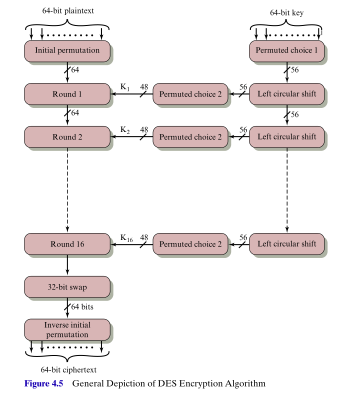

## Introduction

*  My name is Dr Killian O'Brien
* Contacts: [k.m.obrien@mmu.ac.uk](mailto:k.m.obrien@mmu.ac.uk), [Teams chat](https://teams.microsoft.com/l/chat/0/0?users=k.m.obrien@mmu.ac.uk){target="_blank"}, Office JDE 114a (first floor of John Dalton East, Chester St end)

* Office hours are Thurs 2-3pm &amp; Thur 4-5pm - before/after your Thurs lecture.
    - Normally in my office JD E114a
    - Though I might be based in the Learning Studio for these office hours. I'll send a Moodle announcement/email if I am there. 

* 6G6Z0024 Applied Cryptography (15 credits)

* The [Moodle](https://moodle.mmu.ac.uk/course/view.php?id=172138){target="_blank"} page for the unit.

* Reading for this topic
    - <a href="https://mmu.on.worldcat.org/oclc/1334132058" target="_blank">Stallings, Chapter 3, Just Section 3.1: Symmetric Cipher Model</a>

    - <a href="https://mmu.on.worldcat.org/oclc/1334132058" target="_blank">Stallings, Chapter 4: Block Ciphers and the Data Encryption Standard (DES)</a>

## Symmetric Ciphers

Some definitions, (Stallings, *Cryptography and Network Security*, Ch. 3)

* The original intelligible message or data.
* The encryption algorithm performs various substitutions and transformations of the plaintext.
* The secret key $K$ is input into the encryption algorithm along with the plaintext. The algorithm will produce different outputs depending on the specific value of $K$ used for the same plaintext. The exact substitutions and transformations carried out by the algorithm depend on $K$.
* The scrambled message output by the encryption algorithm. It depends on the agorithm, plaintext and key $K$. The ciphertext should be an apparently unintelligible random stream of data. 

## Symmetric Ciphers

{style="width:60%"}

## Symmetric Ciphers

* Bob (message source) sends an encrypted message to Alice (destination)
* The cryptanalyst Eve, intercepts $Y$, has knowledge of the encryption and decryption algorithms, and seeks to develop estimates $\hat X$ and/or $\hat K$ of the plaintext $X$ and key $K$. 

{style="width:60%"}

## Symmetric Ciphers

* The types of attacks carried out by Eve can be classified in various ways,

{style="width:70%"}

<!-- ## Symmetric Ciphers

* Something on security definition. -->

## Stream and Block ciphers

* **Stream cipher**  
* Considers plaintext $P$ as a stream of individual bits, $P=(p_0, p_1, p_2, \dots)$.
* Requires a key stream $K$ of individual bits, $K=(k_0, k_1, k_2, \dots)$, known only to sender and recipient. 
* Encryption is by $\pmod{2}$-addition-without-carry, also known as exclusive-or operation (XOR) $\oplus$.
* Ciphertext $C=(c_0, c_1, c_2, \dots )$ computed as $c_i = p_i \oplus k_i$
    - $0 \oplus 0 = 0$, $1 \oplus 1=0$
    - $0 \oplus 1 = 1$, $1 \oplus 0=1$
* Ideal $K$ is so-called **one-time pad**, a random stream of bits known only to sender and recipient. But this is *impractical*.
* So some kind of keyed algorithm is used to produce the keystream $K$. 
* More on stream ciphers later in the unit. 
* Figure from Stallings, Ch 4, pg 114

## Stream and Block ciphers

* **Block cipher**  
* Plaintext $P$ divided into *blocks* of fixed bit-length $b$, typically 64 or 128 bits used.
* Encryption and decryption algortihms depend on same key $K$, known only to sender and recipient. 
* More widely used design than stream ciphers. 
* Provides a basic encryption/decryption component that can be used to build further ciphers, through so-called *modes of operation*. More on this later.
* Figure from Stallings, Ch 4, pg 114

## Possibilities for block ciphers
* **Outlining the possiblities**  
* The encryption algorithm needs to map blocks of bit-length $n$ to blocks of bit-length $n$. 
* There are $2^n$ possible blocks of length $n$.
* The mapping needs to be *reversible*, i.e. a so-called *permutation* or *non-singular transformation*. 
* There are $(2^n)!$ such transformations to choose from.
* The factorial operator $!$ is defined as $$N! = N \cdot (N-1) \cdot (N-2) \cdot \dots \cdot 3 \cdot 2 \cdot 1.$$
* An example for $n=4$ shown on the right. 
* The key $K$ is, in effect, the whole mapping table. 
* However, with short block lengths, known statistical properties of the plaintexts would leak through to the ciphertexts and allow attacks, such as *fequency analyis*.
* So in practice the block bit-length needs to be large, eg. $n=64$ or $128$. 
* But then the size of the mapping table is **very big** e.g. $2^{64}$ or $2^{128}$, which makes it hard to manage $K$ and keep it secure.
* So instead, require some way to base block ciphers on *smaller keys*.

## Feistel ciphers

* A Feistel cipher uses a block length of $n$ bits and a key of length $k$ bits. So there are $2^k$ possible keys. 
* It employs combinations of the two principles of **substitution** and **permutation** to achieve security.
    - Each plaintext element is uniquely replaced by a corresponding ciphertext element.
    - A sequence of plaintext elements is replaced by a permutation of that sequence. So no new elements are added or deleted, rather the order the elements appear in the sequence is changed.
* These correspond to the theoretical principles of **diffusion** and **confusion** developed by Claude Shannon. See Stallings chapter 4 for discussion.

## Feistel cipher structure

* Feistel cipher diagram  
* Encryption down the left hand side
* Plaintext of block length $2w$ divided into two halves, $LE_0$ and $RE_0$.
* Repeated rounds of processing applied.
* Round $i$ takes inputs $LE_{i-1}$, $LR_{i-1}$ and a subkey $K_i$, derived from the overall key $K$, and uses a **round function** $F$.
* A **substitution** applied to $LE_{i-1}$ to defined by
$$RE_{i} = F(RE_{i-1}, K_{i}) \oplus LE_{i-1}.$$
* $\oplus$ is bit-wise $\text{XOR}$ operation.
* A **permutation** is then applied for the round to output
$$LE_{i} := RE_{i-1} \quad \text{ and } RE_{i} = F(RE_{i-1}, K_{i}) \oplus LE_{i-1}.$$

## Feistel cipher structure

* Decryption takes place up the right hand side.  
* Ciphertext divided into two halves, $LD_0 = RE_{16}$ and $RD_0 = LE_{16}$.
* Round $i$ will output
$$LD_{i} := RD_{i-1} \quad \text{ and } RD_{i} = F(RD_{i-1}, K_{16-(i-1)}) \oplus LD_{i-1}.$$
* Note that the output of decryption round $i$ will be the swap of the two halves of the input to encryption round $16-(i-1)$, for example
$$LD_1 = RD_0 = LE_{16} = RE_{15}, \text{ and}$$
$$RD_1 = LD_{0} \oplus F(RD_0, K_{16}) = RE_{16} \oplus F(RE_{15},K_{16})$$
* But notice that 
$$ RE_{16} \oplus F(RE_{15},K_{16}) = \Big ( LE_{15} \oplus F(RE_{15},K_{16}) \Big )  \oplus F(RE_{15},K_{16})$$
* But $\oplus$ satisfies $(x \oplus y ) \oplus y = x \oplus (y \oplus y) = x \oplus 0 = x$.
* So in summary 
$$LD_{1} = RE_{15} \text{ and } RD_1 = LE_{15}.$$

## Feistel cipher structure

* The repeated **substitutions** using $F$ and **permutations** ensure that the original plaintext is strongly encrypted.  
* Exact implementation of a Fesitel cipher will depend on:
    - **Block size**: Larger size means more security, but slower computation speed. A trade-off of $64$ bits has traditionally been used. However, the newer scheme AES uses $128$-bit blocks.
    - **Key size**: Again, larger means more secure but may decrease computation speed. Key sizes of less than 64 bits now considered inadequate and 128 bits or longer has become common. 
    - **Number of rounds**: More is more secure, but longer computation times. Typical size is 16 rounds. 
    - **Sub-key generation algorithm**: Greater complexity in this will enhance security. 
    - **Round function $F$**: Greater complexity in this will enhance security. 

## Data Encryption Standard (DES)

* DES follows the Feistel cipher structure with added steps of an initial permutation of the plaintext and a corresponding final inverse initial permutation step.  
* Precise details are involved. See Appendix C of Stallings of specifications of
    - initial permutation, 
    - round permutations
    - round function $F$
    - sub key generation algorithm
* NIST = National Institute of Standards and Technology, a US government standards body.
* DES issued by NIST in 1977
* In 1999 advised to only use DES for legacy systems and instead advised triple-DES.
* Advanced Encryption Standard (AES) issued by NIST in 2001 and recommended over DES.

## Avalanche effect in DES

For convenience, $64$-bit blocks are presented as 16 digit hexadecimal values, where the digits

`0,1,2,...,8,9,a, ... ,f`

denote the $4$-bit values 

`0000,0001,0010,..., 1000,1001,1010,1111`

## Avalanche effect in DES

* Table 4.3 from Stallings shows the effect of DES on plaintext blocks that differ only in a single bit, their fourth bit position  
* Middle column shows intermediate states of the block.
* $\delta$ column counts the number of bit positions where the intermediate blocks differ. 
* Note the way $\delta$ increases rapidly.
* By the end $\delta = 32$, which is the expected number of positions for two randomly selected $64$-bit blocks to differ in. 
* The small change in inputs has **avalanched** through DES and heavily affected the output. This is one source of security of DES and Feistel ciphers in general.

## Avalanche effect in DES

* Table 4.4 from Stallings shows the effect of DES on the same plaintext block `02468aceeca86420` but where two differen keys have been used.  
* The two keys are `0f1571c947d9e859` and `1f1571c947d9e859`, so again, differing only in their fourth bit position.
* Middle column shows intermediate states of the block.
* $\delta$ column counts the number of bit positions where the intermediate blocks differ. 
* Note the way $\delta$ increases rapidly.
* By the end $\delta = 30$, which is near the expected number of positions for two randomly selected $64$-bit blocks to differ in. 
* The small change in keys has **avalanched** through DES and heavily affected the output. This is one source of security of DES and Feistel ciphers in general.

<!-- ## Stength of DES -->

