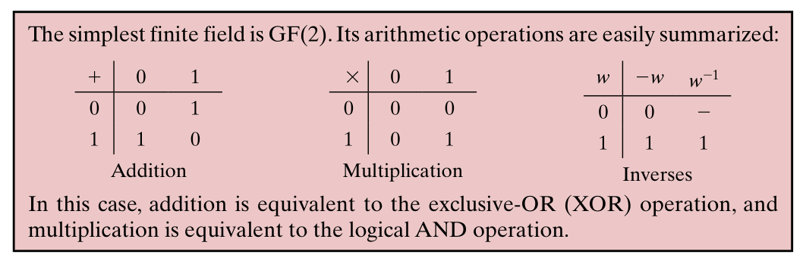
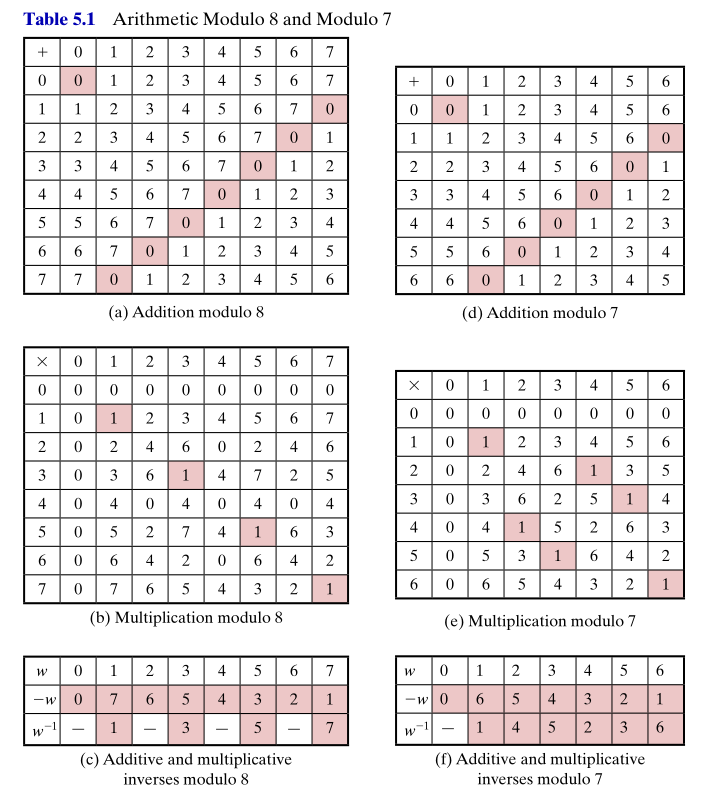
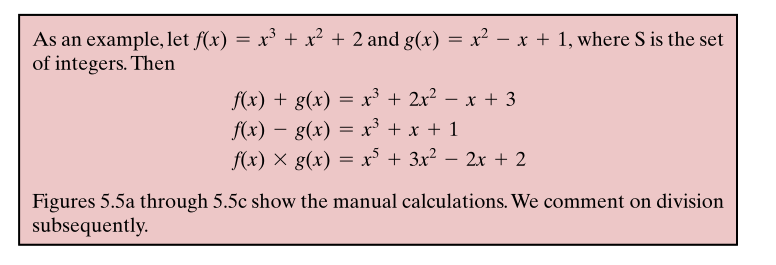
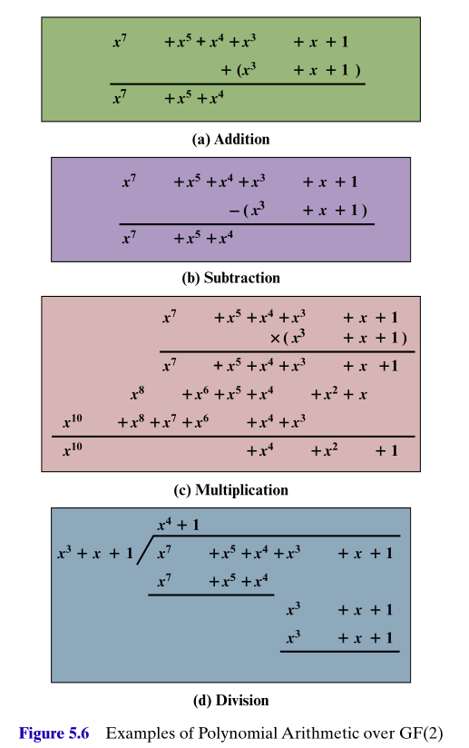

## Introduction

* Cryptography relies heavily on mathematics
* The notion of **finite fields** and **modular polynomial arithmetic** important in ciphers like AES and Elipptic Curves.
* These mathematical systems provide the security and operational requirement needed by the ciphers. 

## Hierarchy of algebraic systems

#### The familiar system $(\mathbb{R}, + , \cdot)$

* Consider the set of real numbers $\mathbb{R}$
* $\mathbb{R}$ can be thought of as consisting of every number on the *real number line*, a line extending from $-\infty$ to $+\infty$.
* Real numbers $x$ can be written down as numbers with a (potentially infinite) decimal expansion. 
* The real numbers, together with the usual operations of addition, $+$, and multiplication, $\cdot$, have the structure of what mathematicians call a **field**. 
* That is the system $(\mathbb{R}, +, \cdot)$ satisfies the following properties.
    - **(A1)** *Closure for addition:* If $a,b \in \mathbb{R}$ then $a+b \in \mathbb{R}$. 
    - **(A2)** *Associativity for addition:* For all $a,b,c \in \mathbb{R}$ we have $(a+b)+c = a+(b+c)$.
    - **(A3)** *Additive identity element:* There is an element $0 \in \mathbb{R}$ such that for all $a \in \mathbb{R}$ we have $a+0 = 0 + a = a$.
    - **(A4)** *Additive inverses:* For each $a \in \mathbb{R}$ there exists an element $b \in \mathbb{R}$ such that $a+b = b+ a =0$. This element $b$ is of course the *negative of $a$* and usually written as $b = -a$.
    - **(A5)** *Commutativity of addition:* For all $a,b \in \mathbb{R}$ we have $a+b= b+a$. 
* A system $(S,+)$ satisfying (A1) - (A4) is called a **group**, and if it also satisfies (A5) it is called an **abelian group**. 

## Hierarchy of algebraic systems

#### The familiar system $(\mathbb{R}, + , \cdot)$

* The system also satisfies
    - **(M1)** *Closure for multiplication:* If $a,b \in \mathbb{R}$ then $a\cdot b \in \mathbb{R}$. 
    - **(M2)** *Associativity for multiplication:* For all $a,b,c \in \mathbb{R}$ we have $(a\cdot b)\cdot c = a\cdot (b\cdot c)$.
    - **(M3)** *Distributive laws:*
        - for all $a,b,c \in \mathbb{R}$ we have $a \cdot (b+c) = a \cdot b + a \cdot c$.
        - for all $a,b,c \in \mathbb{R}$ we have $(b+c)\cdot a = b \cdot a + c \cdot a$.
    - **(M4)** *Commutativity of multiplication:* For all $a,b \in \mathbb{R}$ we have $a\cdot b= b\cdot a$.
    - **(M5)** *Multiplciative identity:* There is an element $1 \in \mathbb{R}$ such that for all $a \in \mathbb{R}$ we have $a\cdot 1 = 1 \cdot a = a$.
    - **(M6)** *No zero-divisors:* If $a,b \in \mathbb{R}$ and $a \cdot b = 0$ then $a=0$ or $b=0$.
* A system $(S,+, \cdot)$ satisfying (A1) - (A4) and (M1)-(M3) is called a **ring**, and if it also satisfies (M4) it is called an **abelian ring**.
* A system $(S,+, \cdot)$ satisfying (A1) - (A4) and (M1)-(M6) is called an **integral domain**.
* Finally,
    - **(M7)** *Multiplicative inverses:* If $a \in \mathbb{R}$ and $a \neq 0$ then there exists an element $b \in \mathbb{R}$ such that $a\cdot b = b \cdot a = 1$. This element $b$ is of course the *reciprocal of $a$* and usually written as $b = a^{-1}$.
* A system $(F,+, \cdot)$ satisfying (A1) - (A4) and (M1)-(M7) is called a **field**.

## Fields

* Essentially, a field $(F,+, \cdot)$ is a system within which we can perform addition, subtraction, multiplication and division, without leaving the set $F$, and the usual proeprties we are familiar with, from $\mathbb{R}$ say, hold true. 
* Subtraction and division are defined interms of addition and multiplication as 
    - $a - b = a + (-b)$
    - $a/b = a \cdot b^{-1}$
* Fields provide a mathematical system in which we have a rich calculation environment following well understood rules.
* They, and other related agebraic structures, are of intense interest for their purely mathematical properties ....
* ... and also find applications in other mathematical areas such as geometry, and more practical application areas such as cryptography and computer science. 

## Finite fields of the form $\text{GF}(p)$

* $\text{GF}( m )$ notation named for *Galois Field* after French mathematician Évariste Galois. It stands for a finite field containing $m$ elements. 

* In cryptography, two of the important finite fields are $\text{GF}(2)$ and, more generally, $\text{GF}(p)$, for a prime $p$. 

* $\text{GF}(2)$: This just consits of the binary elements $0$ and $1$, under the following rules.

 

## Finite fields of the form $\text{GF}(p)$

*  A finite field $\text{GF}(p)$ can be formed by our familiar modular arithmetic modulo $p$, i.e. $\text{GF}(p) = \mathbb{Z}_p$. 
* Table to the right show the operation and inverse tables for $\mathbb{Z}_7$. 
* Note that $\mathbb{Z}_m$, where $m$ is not a prime, will not be a field due to the lack of multiplicative inverses for all elements.
* For example, consider the operation and inverse tables of $\mathbb{Z}_8$ shown on the right. 
* Finding mutliplicative inverses in $\text{GF}(p) = \mathbb{Z}_p$:
    - If $p$ is a prime and $1 \leq a \lt p$ then necessarily $\gcd(a,p)=1$.
    - Run the extended Euclidean algorithm to find integers $x,y$ such that 
    $$ ax + py = \gcd(a,p) = 1.$$
    - Then reducing this equation modulo $p$ gives 
    $$ax \equiv 1 \pmod{p},$$
    so $a^{-1} = (x \, \,\text{mod} \,\,  p)$.

## Polynomial arithmetic

* So for $\text{GF}(p)$ we have a model $\mathbb{Z}_p$. But what about $\text{GF}(m)$ for other useful values of $m$ such as $m = 2^n$?
* For this we will need **polynomial arithmetic**.
* A **polynomial of degree $n$** is a function $f(x)$ of the form 
$$f(x) = a_n x^n + a_{n-1} x^{n-1} + \dots + a_1 x + a_0 = \sum_{i=0}^n a_i x^i.$$
* The coefficients $a_i$ will be coming from some specified set such as the integers $\mathbb{Z}$, modular integers $\mathbb{Z}_m$ or some finite field.
* We will be interested in the polynomial object $f$ itself, not so much in its particular values. So the $x$ will remain mostly unspecified, or *indetermined*. 

*  **Polynomial arithmetic** includes the operations of addition and multiplication of polynomials. For example, with coefficients from the set $S$ of integers

## Polynomial arithmetic with coefficients in $\mathbb{Z}_p$

* Can be shown that the system of polynomials $\sum_{i=0}^n a_i x^i$, with coefficients $a_i$ coming from the field $\mathbb{Z}_p$, will form a commutative ring.
* The division process among such polynomials can still be carried out, but it will be a process of *division with remainder* like we have seen previously in the system $\mathbb{Z}$.

**Polynomial division** 

* For a first example consider the system of polynomials with integer coefficients. 
* Let $f(x) = x^3 + x^2 + 2$ and $g(x) = x^2 - x +1$, then we can say that 
$$f(x) = (x+2) g(x) + x,$$
i.e. that dividing $f(x)$ by $g(x)$ gives a *quotient* of $(x+2)$ and a *remainder* of $x$. 
* We can write $( f(x) \,\, \text{mod} \, \, g(x)) = x$.
* Can carry out the calculation using some form of *long division*, see boards. 
* Can multiply out the above equation to verify the result. 

## Polynomial arithmetic with coefficients in $\text{GF}(2) = \mathbb{Z}_2$

*  For cryptography purposes, polynomials with coefficients in $\text{GF}(2) = \mathbb{Z}_2$ are of most interest. 
* That is, these are polynomials with binary coefficients, i.e. $0$ or $1$, and these coefficients follow the rules of arithmetic in $\mathbb{Z}_2$,
$$0+0=0, 1+1=0, 1+0=1, 1-1=0, 0-1=1, \dots $$
* This setup can make the resulting polynomial arithmetic tricky to follow. 
* See the examples on the right for polyomial arithmetic operations two such polys $f(x) = x^7 + x^5 +x^4+x^3+x+1$ and $g(x) = x^3 + x +1$.
* A polynomial $f(x)$ with coefficients from a field $F$ is called **irreducible** if and only if $f(x)$ cannot be expressed as a product of two other such polynomials, both of degree greater than 0 and less than the degree of $f$. 
* For example, 
    - for polynomials over $\mathbb{Z}_2$, the poly $f(x) = x^4+1$ is reducible as 
$$x^4+1 = (x+1)(x^3+x^2+x+1).$$
    - but $g(x) = x^3 + x +1$ is irreducible since neither $x$ nor $x+1$, the only such polys of degree 2, is a factor of it.

<!-- ## Finite fields of the form $\text{GF}(2^n$)

## Modular polynomial arithmetic

## Using a generator -->

