## Introduction

* The **Advanced Encryption Standard** (AES), published by NIST in 2001.
* To replace DES due to security concerns over small key size and other considerations. 
* AES designed to be more secure and fast.
* From 2008 on, chip manufacturers implement AES capabilities in low-level chip design. 
* Now the most widely used cipher. 

## Polynomial arithmetic and the fields $GF(2^n)$

* Consider all polynomials 
$$f(x) = a_{n-1} x^{n-1} + a_{n-2} x^{n-2} + \dots + a_1 x + a_0 = \sum_{i=0}^{n-1} a_i x^i, \quad a_i \in \mathbb{Z}_2.$$
of degree $n-1$ or less.
* Arithmetic follows the rules of $+$ and $\cdot$ for polynomials, with arithmetic of the coefficients $a_i$ carried out in $\mathbb{Z}_2$, i.e. addition of coefficients is the same as $\text{XOR}$.
* If multiplication results in a polynomial of degree greater than $n-1$ then the product is reduced modulo a specified irreducible polynomial $m(x)$ of degree $n$, the modulos polynomial. 

## AES and $\text{GF}(2^8)$. 

 * 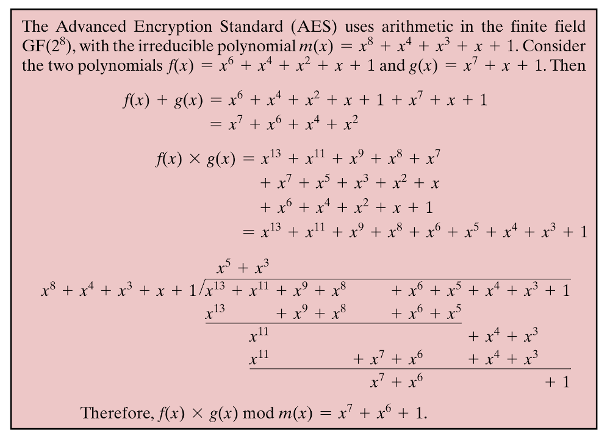 The Advanceed Encryption Standard (AES) uses such a field $\text{GF}(2^8)$, consisting of polynomials of degree less than or equal to 7, with binary coefficients and polynomial operations carried out modulo the irreducible polynomial 
 $$m(x) = x^8 + x^4 + x^3 + x +1.$$
 * The figure on the right shows the calculation of an example product in $\text{GF}(2^8)$.
 * AES uses this since it is designed to operate on 8-bit bytes.
    - addition of bytes is just bit-wise $\text{XOR}$.
    - *multiplication* of bytes is defined as multiplication in the finite field $\text{GF}(2^8)$, modulo the irreducible polynomial $m(x) = x^8 + x^4 + x^3 + x +1.$

## The structure of AES

* 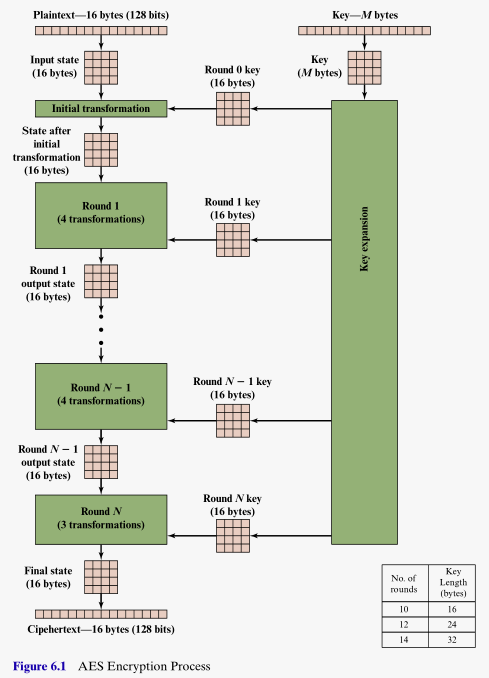 Operates on plaintext message blocks of 16 bytes = 128 bits. 
* Various key lengths allowed, 16, 24 or 32 bytes. Ciphers referred to as AES-128, AES-192 or AES-256, depending on how many bits used in key. 
* Throughout encryption (and decryption) the message block is maintained as a $4 \times 4$ array of bytes. This is referred to as the **state**.
* First four bytes form the first column, next four bytes the second column, and so on. 
* An initial transformation of the state is followed by $N$ rounds. Where $N$ depends on the ley length used.
    - $N=10$ for 128 bit key.
    - $N=12$ for 192 bit key.
    - $N=14$ for 256 bit key.
* The key passes through a *key explansion* transformation to provide $N+1$ sub-keys to be used in the initial transformation and $N$ rounds. 
* Each sub-key consists for four 4-byte **words**, which form the columns of the **round key matrix**.

## AES detail

* 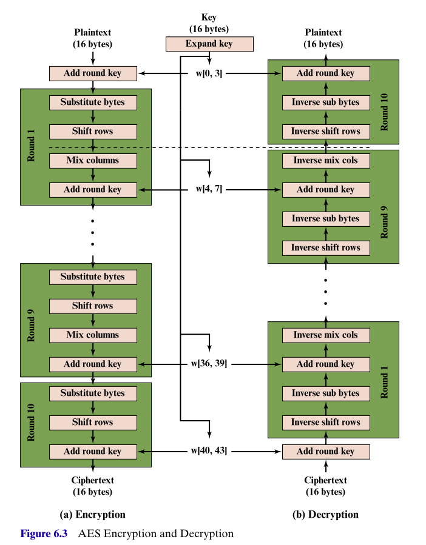 This figure exposes the transformations within each round, for AES-128. The other schemes are similar. 
* Note that is departs from the Feistel design. There is no notion of dividing the block into halves. 
* Rounds 1 - 9 consists of four transformations
    - **Substitute bytes**: and S-box type permutation of the bytes of the state. 
    - **Shift rows**: a simple permutation of the bytes within each row of the state. 
    - **Mix columns**: a transformation that combines the bytes within each column of the state. This transformation utilies the $\text{GF}(2^8)$ field.
    - **Add round key**: bit-wise $\text{XOR}$ of the state with the appropriate round key matrix. 
* The decryption algorithm reverses all the transformations. At each horizontal level, the intermediate states of the encryption and decryption algorithms are the same. 

## Visualizing a single round

* 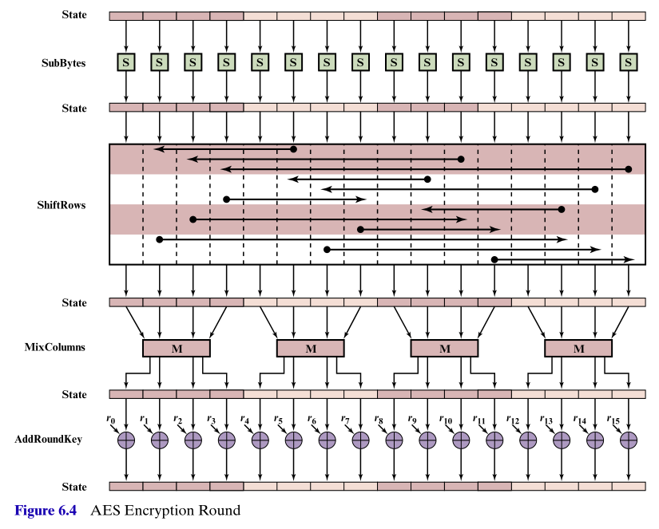 This figure visualizes the four transformations within a typical round.
* Here the state matrix is shown laid out as a row of 16 bytes. 

## Substitute bytes

* 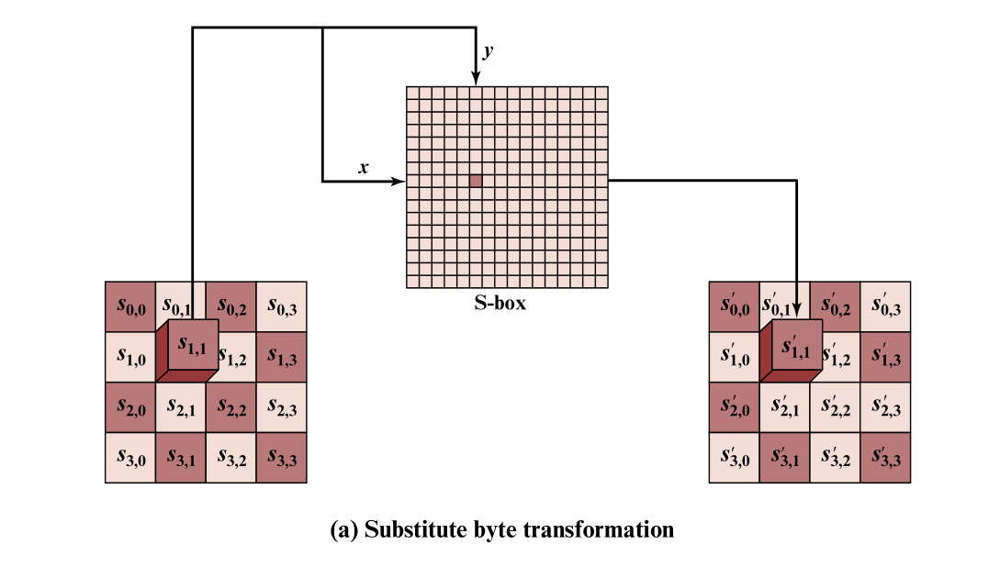 This figure shows the how the substitute bytes transformation is defined. 
* For each entry of the incoming state matrix, i.e. for each byte
    - the first four bits denote the row index $x$ of the S-box
    - the second four bits denote the column index $y$ of the S-box
    - the S-box entry at that row and column is a byte that replaces the original byte of the state. 
* After replacing each entry of the incoming state matrix, we get the outgoing state matrix. 

## The S-box itself

* 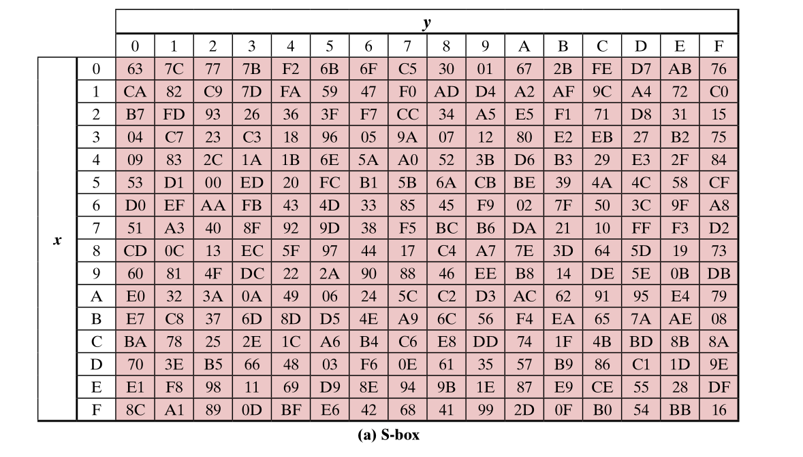 This figure shows the S-box.
* Remember
    - a four bit block is denoted by a hexadecimal digit `0,1,...9,a,b,c,d,e,f`.
    - a single byte (i.e. a 8-bit block) is denoted by a two-digit hexadecimal number.
* A corresponding inverse S-box table is used in the decryption algorithm.
* Lots of detail in Stallings on the contruction of this S-box table. 
    - Designed like this to minimize any correlation between incoming and outgoing bits.
* An example substitute bytes transformation is shown here 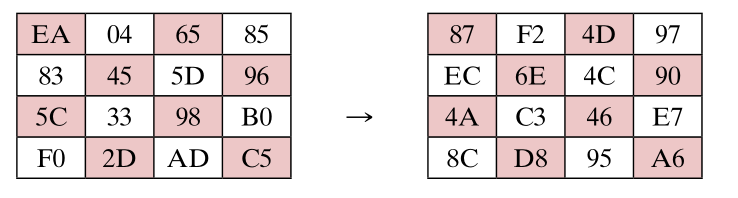 

## The shift rows transformation

* 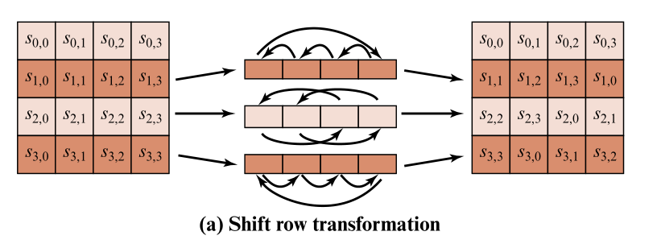 In each of the second, third and fourth rows of state, permute the bytes in each row as shown.
* This has a significant effect on the original positions of the bits within the 128 bit message block. 

## Mix columns transformation

* 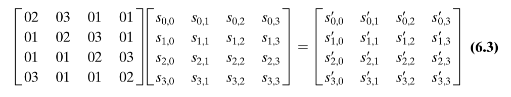 The equation shows how the incoming state matrix $s_{i,j}$ is multiplied by the matrix of constants to get the outgoing state matrix $s'_{i,j}$, shown on the right of the equation. 

* This results in the following transformations within the $j^{\text{th}}$ column of the state 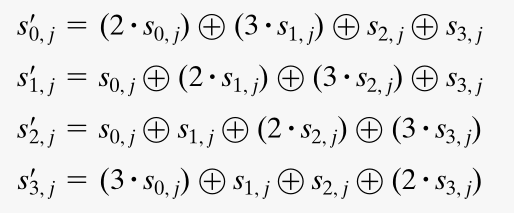

* The operations $\oplus$ and $\cdot$ shown here are the operations from $\text{GF}(2^8)$, carried out on the entries of the state, i.e. on the bytes, i.e. on the 8-bit blocks which are interpreted as the coefficients of degree 7 polynomials. 
* So $\oplus$ is bitwise $\text{XOR}$ and $\cdot$ is the multiplication obtained from the multiplication of these polynomials, modulo the polynomial $m(x) = x^8 + x^4 + x^3 + x +1.$
* The design of this Mix Columns transformation ensures good mixing of the bytes within a column, and the use of the constants `01`, `02` and `03` results in efficient implementation of the encryption algorithm. 

## Add round key transformation

* Perhaps the most straightforward, this is just bitwise $\text{XOR}$ amongst the bit entries of the state and round key matrices. 
* Consider the examples shown here 
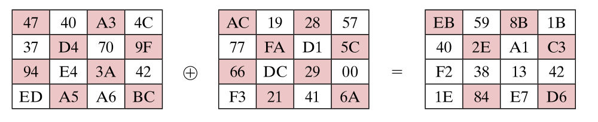 of 
$$\text{incoming state} \oplus \text{round key} = \text{outgoing state}$$

## A summary flowchart for AES encryption

* 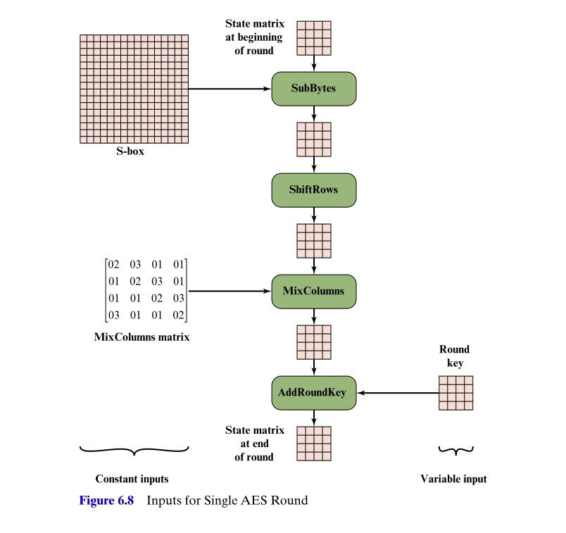 This figure summarizes a typical encryption round. 

* We still need to describe the key expansion process for the derivation of the round keys from the original key. 

## Key expansion in AES

*  **Key expansion** is the process where the initial key is expanded to produce the $N+1$ round keys for the initial transformation and the $N$ rounds of AES.
* Each round key consists of four 4-byte words, i.e. the four columns of the round key matrix. 

## Key expansion in AES-128

* 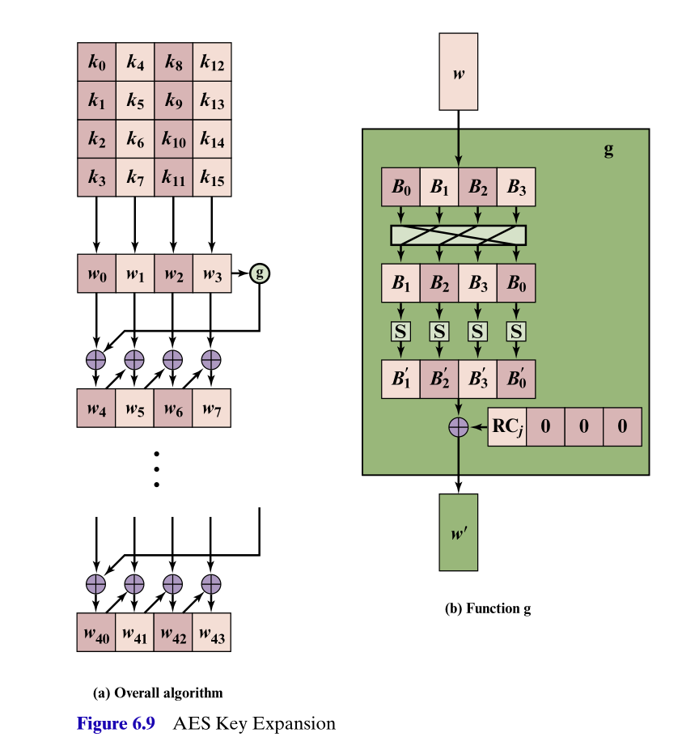 The $i^{\text{th}}$ of the $N+1$ round keys consist of the four keywords 
$$w_{4i + 0}, w_{4i + 1},w_{4i + 2},w_{4i + 3}.$$
* The 16 bytes, $k_0, k_1, \dots, k_{15}$, of the initial key form the first four key words $w_0,w_1, w_3, w_3$ as shown.
* An iterative process creates the 40 subsequent key words. 
    - for $j=1,2,3$, and $i =1,\dots, 10$,
    $$w_{4i+j} = w_{4i+j-1} \oplus w_{4(i-1)+j}.$$
    - for $j=0$ and $i =1 \dots 10$,
    $$w_{4i} = g(w_{4i-1}) \oplus w_{4(i-1)}.$$
    - the function $g$ is the composition of 
        - a circular left-shift of the word bytes
        - an S-box byte substitution using the same S-box table as in the AES encryption rounds
        - a bitwise $\text{XOR}$ with the word formed by the bytes RC~i~, 00, 00, 00. The round constants RC~i~ are shown on table on next slide.
        

        

## Design considerations of the key expansion algorithm

* The round constants RC~i~.
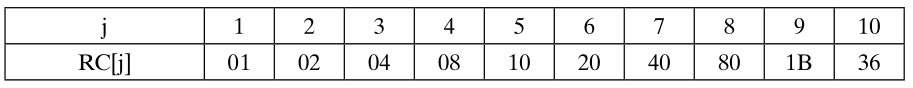 

* These transformations were chosen to ensure these features, amongst others, 
    - speedy implementations in software and chip hardware,
    - partial knowledge of the original key or intermediate round keys will not enable determination of many other bits of other key words,
    - use of different round constants eliminates any potential symmetries in the round key generations,
    - diffusion, i.e. each bit of the original key effects many round key bits.

* Further details, worked examples, and illustrations of bit diffusion from plaintext and key differences can be found in <a href="https://mmu.on.worldcat.org/oclc/1334132058" target="_blank">Stallings, Chapter 6: AES</a>
