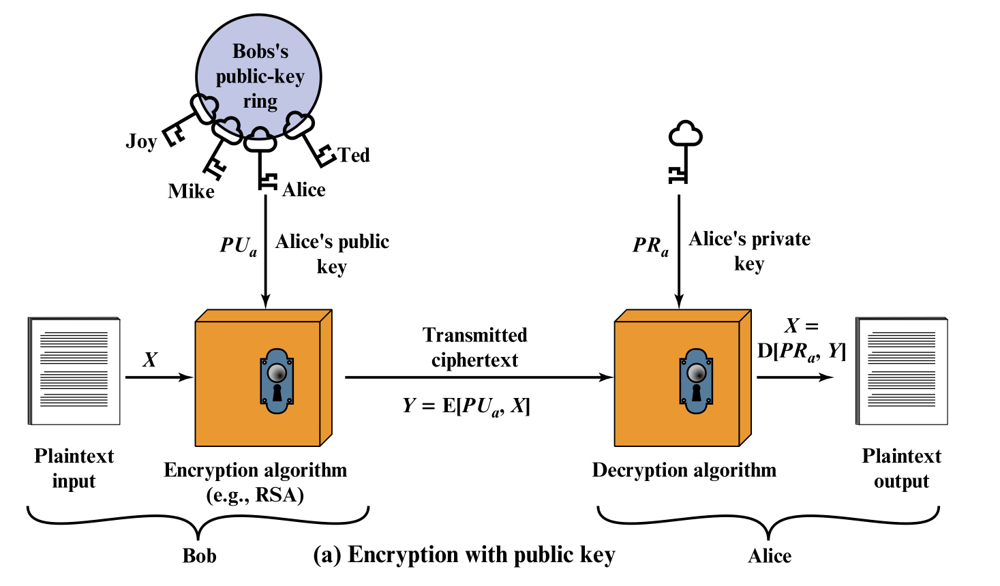
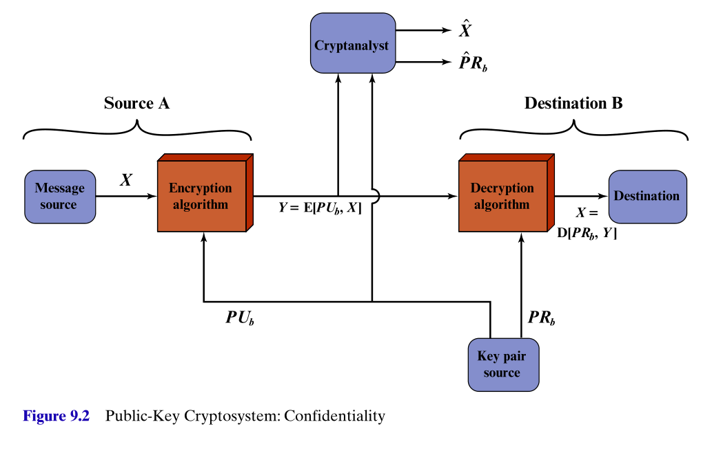

## Introduction and initial promise

* Reading: <a href="https://mmu.on.worldcat.org/oclc/1334132058" target="_blank">Stallings, Chapter 9, <em>Public-key cryptography and RSA</em></a>

* Symmetric ciphers, such as DES, and then AES, can provide excellent security, but rely on the distribution of *secret keys* between the parties.
    - How are these secret keys to be distributed in a secure and efficient way?
* Public-key cryptography, an asymmetric approach (different keys for encryption and decryption) solves this by using two keys, 
    - a **public key** (which does not need to be kept secret) to encrypt messages,
    - and a **private key** (which must be kept secret, but which only the receiver needs) to decrypt messages.
* Public-key cryptography promises and enables something, which seems almost paradoxical. Suppose that
    - two parties, Alice and Bob, wish to communicate,
    - they have never met or communicated before, and do not have any access to pre-arranged secret keys,
    - **ALL** their communications can be intercepted and inspected by the eavesdropper, Eve,
    - nevertheless, using public-key techniques, Alice and Bob can exchange some initial unencrypted communications, and then pass into secure encrypted communication,
    - even though **ALL** their initial unencrypted communications were intercepted, read and understood by Eve. 

## Discovery

* Discovered by Whitefield Diffie and Martin Hellman at Stanford University in 1976. 
* Though in 1997, UK government declassified material revealing that James Ellis, Clifford Cocks and Martin Williamson, working at GCHQ, made the same discoveries earlier in the 1970s.
* Two problems are solved by these methods
    - encrypted communications without the need for secretly pre-arranged keys,
    - **digital signatures** enabling the cryptographic proof that a message was authored by the claimed author.

## Basic principles / requirements

*  A pair of related keys are generated by the user Alice, a **public key** $\text{PU}_a$, and a **private key**, $\text{PR}_a$.
* The public key is published for all to see. 
* The private key is kept private and secure. 
* Messages can be encrypted using this public key, and communicated to Alice. 
* The messages can be decrypted by Alice using her private key. 
* Details of the public key, encryption and decryption algorithms are all public. 

## The eavesdropper's/cryptanalsyt's task

*  The cryptanalyst intercepts encrypted message $Y$ and attempts to form estimates of the original plaintext $X$ or the private key $\text{PR}_b$. 

## Outline of a digital signature approach

*  Using keys of both sender and recipient can enable **authenticated** and encrypted communication.
* The receiver Bob is assured that only the holder of the private key corresponding to Alice's public key could have authored this message $X$.
* Alternatively, the middle encryption step can be skipped, and Alice can simply publish the encrypted message $Y$, which anyone can decrypt with her public key $\text{PU}_a$. Any such receiver is assured that only the holder of the private key corresponding to Alice's public key could have authored this message $X$.

## Firming up the requirements (Stallings, pg. 294)

* It is computationally easy for a party $B$ to generate keys pairs $PU_b$ and $PR_b$.
* It is computationally easy for a sender $A$, with the public key $PU_b$ and plaintext $M$, to generate the corresponding ciphertext
$$C = E(PU_b,M).$$
* It is computationally easy for the receiver $B$ to decrypt $C$ using $PR_b$, to recover $M$ as
$$M = D(PR_b,C) = D \big ( PR_b, E(PU_b,M) \big ).$$

## The RSA system

* Historical points.
* The claim it will fulfill the requirements. 

* Description with review of modular arithmetic

## Computation aspects of RSA encryption/decryption

* Exponentiation
    - useful modular properties
    - repeated squaring
    - efficiencies with public and private keys (maybe skippable, but good for at least one lab / homework problem)
        - don't understand the timing attack point yet

### Lab session / assessment ideas

* You need tasks that assess the basic central understanding you want them to have. The extras beyond that then are nice to haves. 
* Can choose p,q as the next two primes following their student number. 
    - This can feed into RSA encryption/decryption problems and the computational efficiency questions. 