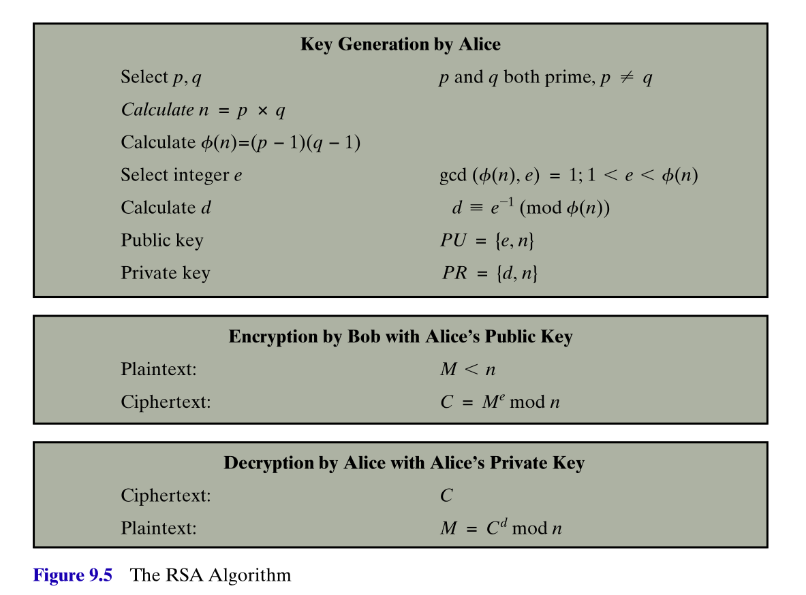
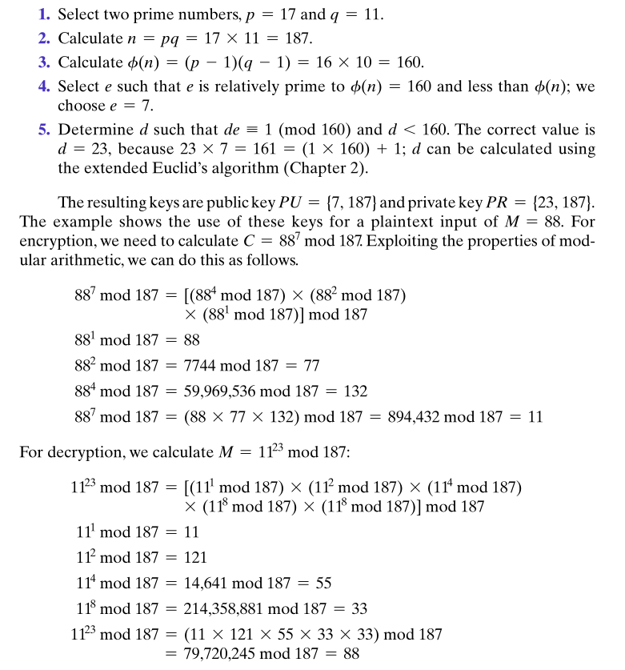

## Introduction and initial promise

* Reading: <a href="https://mmu.on.worldcat.org/oclc/1334132058" target="_blank">Stallings, Chapter 9, <em>Public-key cryptography and RSA</em></a>

* Symmetric ciphers, such as DES, and then AES, can provide excellent security, but rely on the distribution of *secret keys* between the parties.
    - How are these secret keys to be distributed in a secure and efficient way?
* Public-key cryptography, an asymmetric approach (different keys for encryption and decryption) solves this by using two keys, 
    - a **public key** (which does not need to be kept secret) to encrypt messages,
    - and a **private key** (which must be kept secret, but which only the receiver needs) to decrypt messages.
* Public-key cryptography promises and enables something, which seems almost paradoxical. Suppose that
    - two parties, Alice and Bob, wish to communicate,
    - they have never met or communicated before, and do not have any access to pre-arranged secret keys,
    - **ALL** their communications can be intercepted and inspected by the eavesdropper, Eve,
    - nevertheless, using public-key techniques, Alice and Bob can exchange some initial unencrypted communications, and then pass into secure encrypted communication,
    - even though **ALL** their initial unencrypted communications were intercepted, read and understood by Eve. 

## Discovery

* Discovered by Whitefield Diffie and Martin Hellman at Stanford University in 1976. 
* Though in 1997, UK government declassified material revealing that James Ellis, Clifford Cocks and Martin Williamson, working at GCHQ, made the same discoveries earlier in the 1970s.
* Two problems are solved by these methods
    - encrypted communications without the need for secretly pre-arranged keys,
    - **digital signatures** enabling the cryptographic proof that a message was authored by the claimed author.

## Basic principles / requirements

*  A pair of related keys are generated by the user Alice, a **public key** $\text{PU}_a$, and a **private key**, $\text{PR}_a$.
* The public key is published for all to see. 
* The private key is kept private and secure. 
* Messages can be encrypted using this public key, and communicated to Alice. 
* The messages can be decrypted by Alice using her private key. 
* Details of the public key, encryption and decryption algorithms are all public. 

## The eavesdropper's/cryptanalsyt's task

*  The cryptanalyst intercepts encrypted message $Y$ and attempts to form estimates of the original plaintext $X$ or the private key $\text{PR}_b$. 

## Outline of a digital signature approach

*  Using keys of both sender and recipient can enable **authenticated** and encrypted communication.
* The receiver Bob is assured that only the holder of the private key corresponding to Alice's public key could have authored this message $X$.
* Alternatively, the middle encryption step can be skipped, and Alice can simply publish the encrypted message $Y$, which anyone can decrypt with her public key $\text{PU}_a$. Any such receiver is assured that only the holder of the private key corresponding to Alice's public key could have authored this message $X$.

## Firming up the requirements (Stallings, pg. 294)

* It is computationally easy for a party $B$ to generate keys pairs $PU_b$ and $PR_b$.
* It is computationally easy for a sender $A$, with the public key $PU_b$ and plaintext $M$, to generate the corresponding ciphertext
$$C = E(PU_b,M).$$
* It is computationally easy for the receiver $B$ to decrypt $C$ using $PR_b$, to recover $M$ as
$$M = D(PR_b,C) = D \big ( PR_b, E(PU_b,M) \big ).$$
* It is computationally infeasible for an adversary, knowing the public key $PU_b$, to determine the private key $PR_b$. 
* It is computationally infeasible for an adversary, knowing the public key $PU_b$ and ciphertext $C$, to recover the original message $M$.

While not essential, the following useful property is possessed by the RSA implementation of public-key cryptography. 

* The two keys can be applied in either order, i.e.
$$M = D \big ( PR_b, E(PU_b,M) \big ) = D \big ( PU_b, E(PR_b,M) \big ) .$$

*This is all very nice to describe, but what exactly is the technology that can enable such a scheme?*

## The RSA system

* Discovered in 1978 at MIT by Ron **R**ivest, Ade **S**hamir and Len **A**dleman.
* It remains one of the most widely used general purpose public-key schemes.
* It deals with messages, or message blocks, encoded as integers in the range $0$ to $n-1$, for some suitably large $n$. 
* Typicall size for $n$ might be 1024 bots, or around 309 decimal digits.
* RSA makes use of exponentials in modular arithmetic. 
* The message $M$ is an integer in the range $0 \leq M \leq n-1$. 
* The receiver chooses integers $e$ and $d$, with the property that
$$ed \equiv 1 \pmod{\phi(n)},$$
i.e. $e$ and $d$ are multiplicative inverses of each other modulo the Euler totient function value $\phi(n)$.
* The public key is $PU = (e,n)$, the private key is $PR = (d,n)$. 
* The plaintext $M$ is encrypted as 
$$C = (M^e \, \, \text{mod} \, \, n).$$
* The ciphertext $C$ is decrypted as 
$$ (C^d \, \, \text{mod} \, \, n ) = ((M^e)^d \, \, \text{mod} \, \, n ) = (M^{ed} \, \, \text{mod} \, \, n ) = (M^1 \, \, \text{mod} \, \, n) = M.$$
* The security comes from the fact that computing $\phi(n)$ from $n$ is **hard**. 

## RSA procedure

*  Figure on the right, from Stallings, outlines the procedure. 

## A small $n$ example

*  Extract from Stallings pg. 298, shows the calculations for an example based on a small $n$. Remember a typical size for $n$ from real usage is circa 309 decimal digits. 
* The Euler totient function value $\phi(n)$, when $n=pq$, for distinct primes $p$ and $q$, is given by 
$$\phi(n) = \phi(pq) = (p-1)\cdot (q-1).$$
* The reason that computing $\phi(n)$ from $n$ is **hard** is that factoring $n$ into the product $p \cdot q$ is hard. Given such a large $n$ there is no easy way to discover its prime factors. 
    - the best known algorithms for factoring integers will take a **long** time to factor $n$, given any realistic amount of computing power available. 

## Modular arithmetic reminder

* RSA involves using $c,d$ that are multiplicative inverses of each other modulo $\phi(n)$. 
* Multiplicative inverses are found using the extended Euclidean algorithm
    - If $a$ is coprime to a modulus $m$, i.e. $\gcd(a,m) = 1,
    - Run the extended Euclidean algorithm to find integer coefficients $x,y$ satisfying
    $$xa + ym = 1.$$
    - Then the inverse is given by 
    $$a^{-1} \, \, \text{mod} \, \, m = (x \, \, \text{mod} \, \, m ),$$
    because
    $$xa = 1 - ym \equiv 1 \pmod{m}.$$

<!-- ## Computation aspects of RSA encryption/decryption

* Exponentiation
    - useful modular properties
    - repeated squaring
    - efficiencies with public and private keys (maybe skippable, but good for at least one lab / homework problem)
        - don't understand the timing attack point yet -->

## Factorization and the choice of $p,q$

* Factorization of large $n$ is computationally **hard**
    - even when using advanced *number field sieve* factoring algorithms. 
* But computational power increases and theoretical advancements should be expected to continue.
* The counter to both these possibilities is to increase the size of $n$, to make factoring harder.
* Recent advice from standards agencies
    - NIST 2015 recommends key lengths of 2048 bits or longer.
    - EU Agency for Network ad Information Security 2014 recommends 3072 bits for future developments.
* Other guidance on choice of $p,q$ is
    - $p$ and $q$ should be of similar digit length. So for a 1024-bit key, they should be chosen in the range
    $$10^{75} \leq p,q \leq 10^{100}.$$
    - both $p-1$ and $q-1$ should contain a large prime factor
    - $\gcd(p-1,q-1)$ should be small. 
* However finding large primes is computationally hard, similar to factoring.
    - In practice, for choosing such large primes, probabilistic prime tests, such as the Miller-Rabin test, need to be used. 
    - This test allows one to choose an integer which is *probably* a prime.
    - But this probability can be made arbitrarily close to 1, i.e. as near certain as one would like. (See chapter 2 of Stallings for details on Miller-Rabin test)