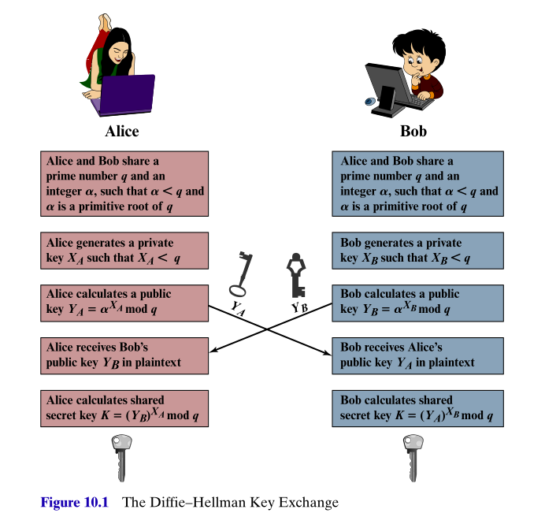
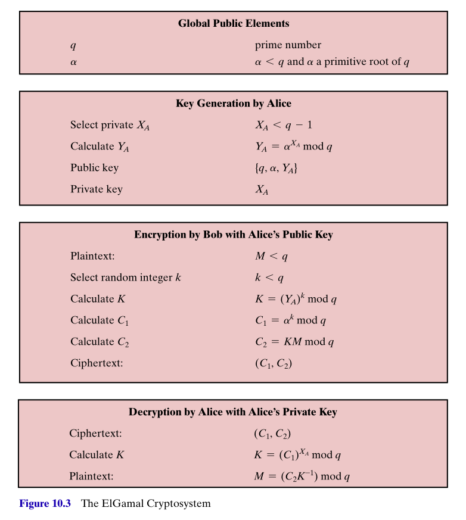

## Introduction 

* Reading: <a href="https://mmu.on.worldcat.org/oclc/1334132058" target="_blank">Stallings, Chapter 10, Sections 10.1, 10.2,<em>Other Public-key cryptosystems</em></a>

In this lecture we shall look at

* Diffie-Hellman key exchange
* the ElGamal system

**Key Exchange**

* In practice, public key cryptography works hand in hand with symmetric encryption, such as AES
* A common approach is for public key encryption to be used to exchange a private key, that is then used to commence communication under symmetric encryption. 
  
**DH key exchange**

* Diffie-Hellman key exchange (1976) is a method that allows two parties to agree on a shared secret (number) by the exchange unencrypted messages.
* This shared secret can then be used to generate a shared secret key to enable secure, encrypted communication. 
* DH key exchange uses a tool from modular arithmetic called *discrete logarithms*.

## Reminder: What are logarithms?

* **Exponentials** -- Given numbers $a,b$, a number of the form $c = a^b$, is called an *exponential* (or power), with *base* $a$, and *exponent* $b$. 
    - we usually have $a>0$
    - for positive integers $b$, $a^b$ is given by repeated multiplication, i.e. $$a^b = a \cdot a \cdot \dots \cdot a,$$ the product of $b$ factors of $a$. 
    - exponentials with negative exponents are defined using $$a^{-b} = \frac{1}{a^b}$$
* **Logarithms** -- These are the *inverses* of exponentials. 
    - So if $c=a^b$ then
    - $\log_a(c) = b$. 
    - We say $b$ is the *logarithm*, with base $a$, of $c$. 
* You might see a function $\log$ mentioned without a base. Its meaning is usually defined from the context/discipline. 
    - Computer scientists would usually mean $\log_2$
    - Mathematicians would usually mean $\log_e$, the *natural logarithm*
    - Engineers might usually mean $\log{10}$

## What are discrete logarithms?

* *Discrete logarithms* is the term for logarithms within modular arithmetic. 
* Working modulo a prime $p$, if $c \equiv a^b \pmod{p}$ then  
    - $b$ is the discrete logarithm of $c$, to the base $a$, modulo $p$. 
    - Stallings introduces the notation $$b = \text{dlog}_{a,p}(c).$$
* Usually the base used is a *primitive root* modulo $p$, i.e. a number $a$ whose powers generall **ALL** the non-zero elements modulo $p$, i.e. the residues $$ (a \text{ mod } p),\, (a^2 \text{ mod } p),\,  (a^3 \text{ mod } p), \dots , (a^{p-1} \text{ mod } p),$$ are all distinct and consist of the integers $$1, 2, \dots, p-1,$$ (though not in that order).
* Security arises from the facts that 
    - computing modular exponentials is fast (using modular reduction, Euler's theorem and repeated squaring)
    - there is no known fast algorithm for computing discrete logarithms. So for suitable large $p$, it cannot be done in any practical way.

## Diffie-Hellman key exchange algorithm -- How Alice and Bob can agree on a shared secret

*  Alice and Bob agree on a (large) prime $q$, and a primitive root $\alpha$, modulo $q$. 
* Alice and Bob generate their own **private** keys $X_A, X_B \lt q$.
* Alice and Bob then calculate their **public keys** $$Y_A = (\alpha^{X_A} \text{ mod } q ), \quad  Y_B = (\alpha^{X_B} \text{ mod } q ).$$
* Alice and Bob exchange their public keys $Y_A$ and $Y_B$. Note that the private keys $X_A$ and $X_B$ are kept private and not exposed. 
* Alice calculates $$K =\left ( (Y_B)^{X_A} \text{ mod } q \right )$$ and Bob calculates $$K =\left ( (Y_A)^{X_B} \text{ mod } q \right .)$$
* Note that 
  $$K =\left ( (Y_B)^{X_A} = \left (\alpha^{X_B} \right )^{X_A} = \alpha^{X_B\cdot X_A} = \left (\alpha^{X_A} \right )^{X_B} = (Y_A)^{X_B}\text{ mod } q \right )$$
* Alice and Bob both know the shared secret $K$. But nobody else does. Even if they've eavesdropped on all these setup communications.

## ElGamal cryptosystem

*  From 1984, provides an enhancement of DH key exchange that introduces an element of authentication into the exchanges. 
* Stallings figure to the right shows what's required for Bob to send encrypted communication to Alice.
* Alice generates and publishes her public key $(q, \alpha, Y_A = \alpha^{X_A})$ as before, still retaining her private key $X_A$.
* Bob prepares plaintext message block $M$ and an element $k$ that is sued to caluclate a temporary secret key $K = (Y_A^k \text{ mod } q)$.
* Bob calculates $$C_1 = (\alpha^k \text{ mod } q), \, \, C_2 = (KM \text{ mod } q),$$ and sends the pair $(C_1, C_2)$ to Alice.
* Alice can recover the secret key $K$ by computing $$K = (C_1^{X_A} \text{ mod } q),$$ and decrypt the message $M$ by computing $$M = ( C_2 K^{-1} \text{ mod } q).$$