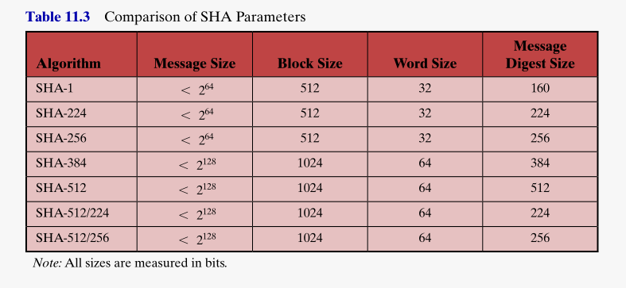
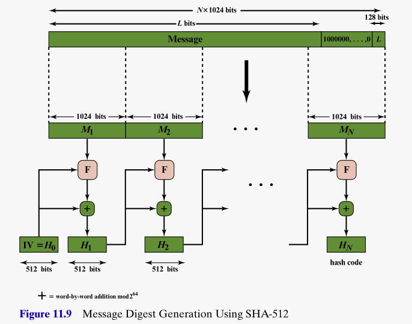

## Introduction 

* Reading: <a href="https://mmu.on.worldcat.org/oclc/1334132058" target="_blank">Stallings, Chapter 11,<em>Cryptographic Hash Functions</em></a>

**Basic idea of a (cryptographic) hash function $H$**

*  $H$ takes a variable-length block of data $M$ and computes a fixed sized output $h=H(M)$.
* $h$ called the *hash value*, or *hash code* or *message digest*. 
* Typically the input message $M$ is split into standard sized blocks, with padding $P$ if necessary, often including data on the length $L$ of $M$.
* Typically $h$ will come from a very large domain of possible values, and different inputs $M$ will produce outputs $h$ that are evenly distributed and apparently random selections from this domain. 
* The inner workings of $H$ will be somewhat complex, but still have fast implenetations in software and/or hardware. 
* For cryptographic hash functions, the inner workings of $H$ will ensure security, in that it should be computationally infeasible to compute
    - a message $M$ that will hash to a given hash value $h$ (pre-image resistance)
    - two messages $M_1$ and $M_2$ that hash to the same hash value (collision resitance)

**Applications in**

* Message authentication, Digital signatures, Password authentication, ...

<!-- ## Applications of cryptographic hash functions

* Message authentication
* Digital signatures
* Password authentication
* ... -->

## Applications of cryptographic hash functions

**Message authentication**

* $H$ can be used to verify the integrity of data in storage or communication. To ensure that it has not been changed. 
* In very simple terms, the hash value can be appended to the data as shown on below on left.
* This is too simple though, and susceptible to *man-in-the-middle attacks*, as shown on right.
*  

## Applications of cryptographic hash functions

**Message authentication possibilities**

*  The diagram on the right shows some ways in whcih $H$ can be used to implement message authentication.
* Diagram key
    - a cryptographic hash function $H$
    - message $M$ to be communicated
    - concatenation operator $||$
    - a secret symmetric key $K$
    - symmetric key encryption $E$
    - a shared secret value $S$

## Applications of cryptographic hash functions

**Digital signatures**

*  Here the emphasis is on authentication and proof of the identity of the sender of the message $M$
* The hash function $H$ can be used in combination with asymmetric public key encryption $E$, with public $PU_a$, and private $PR_a$, keys of the sender $A$. 
* Diagram key
    - a cryptographic hash function $H$
    - message $M$ to be communicated
    - concatenation operator $||$
    - sender $A$'s (public,private) key pair $(PU_a,PR_a)$
    - symmetric/asymmetric (depending on keys used) encryption $E$
  
<!-- ## Requirements and security -->

## Merkle-Damgard iterated hashs function design 

*  Merkle and Damgard proposed this iterated design based on a *compression function* $f$ that produces an $n$-bit hash value. 
* The input message is split into $L$ fixed-size blocks $Y_i$ of $b$ bits each. 
* The final block $Y_{L-1}$ also contains the length information of the original message and any necessary padding to make it up to $b$ bits. 
* The compression function $f$ takes two inputs, the message block $Y$ and an $n$ bit *chaining variable* $CV$, and produces an $n$-bit output chaining variable $CV'$.
* $CV_0 = IV = \text{ standard initial $n$-bit value}$
* $CV_{i} = f(CV_{i-1}, Y_{i-1}), \quad 1 \leq i \leq L$
* $H(M) = CV_L$

## The SHA family and SHA-512

* Secure Hash Algorithm (SHA) family produced by NIST have been the most widely used crpytographic hash functions. 
*  Offers hash functions of increasing complexity and security. 
* As earlier versions become vulnerable to weaknesses incombination with brute-force attack, then later versions adopted.
* Currently SHA-256 and SHA-512 seen as sensible.

## SHA-512

**Overall design**

*  Input message $M$ is padded with `1000...0` until its length is $\equiv 896 \pmod{1024}$.
* Then the bit-length $L$ of $M$ is appended as an unsigned 128-bit integer.
* We now have some number $N$ of 1024-bit blocks, $M_1, M_2, \dots, M_N$.
* The intermediate hash buffer is initialized with standard initial values $H_0 = IV$, derived from the fractional parts of the square roots of the first eight prime numbers (i.e. essentially random bits). 
* An intermediate step of SHA-512 takes the block $M_i$ and previous intermediate hash buffer $H_{i-1}$ and process it with an 80-round processing module $F$.
* This produces a 512-bit output that is combined with an addition-like operation with $H_{i-1}$.  
* The final 512-bit output $H_N$ is the hash value of SHA-512.

## The 80-round processing module $F$

*  This diagram shows the makeup of the processing module $F$.
* Operates on the 8 64-bit words making up the 512-bit intermediate hash buffer $H_{i-1}$.
* The message block $M_i$ supplies 80 different 64-bit words $W_t$ via a *message schedule* algorithm, one for each round.
* 80 different 64-bit constants $K_t$ are used, one for each round. These are derived from the fractional parts of the cube roots of the first 80 prime numbers, again this produces essentially random bits for input. 
* The additions $+$ shown here are carried out word-by-word on the 8 64-bit pairs of inputs, one from $H_{i-1}$, one from the corresponding output of the last of the 80 rounds. The additions are carried out modulo $2^{64}$.

## The detail of the 80 rounds

*  This shows the operations within the one of the 80 rounds.
* The 8 input 64-bit words $a,b,c,d,e,f,g,h$ are processed to the 8 output 64-bit words $a,b,c,d,e,f,g,h$. Some by relabelling, and others by more complex operations.
* The additions $+$ shown here are word additions modulo $2^{64}$. 
* Employs bit-wise logical functions $\text{Ch}$ and $\text{Maj}$, $\oplus$ denotes bit-wise $\text{XOR}$
* $\text{Ch}(e,f,g) = (e \text{ AND } f) \oplus (\text{ NOT } e \text{ AND } g)$. This is equivalent to *If e then f, else g*.
* $\text{Maj}(a,b,c) = (a \text{ AND } b) \oplus (a \text{ AND } c) \oplus (b \text{ AND } c)$. This is true only if the majority of the arguments (i.e. 2 or 3 of them) are true. 
* $\Sigma(a) = \text{ROTR}^{28}(a) \oplus \text{ROTR}^{34}(a) \oplus \text{ROTR}^{39}(a)$, where $\text{ROTR}^n$ denotes circular right shift if the bits by $n$ bits. 
* $\Sigma(e) = \text{ROTR}^{14}(a) \oplus \text{ROTR}^{18}(a) \oplus \text{ROTR}^{41}(a)$, where $\text{ROTR}^n$ denotes circular right shift if the bits by $n$ bits. 

## SHA-512 message schedule algorithm

*  This shows the operations within the one of the 80 rounds.
* First 16 64-bit words $W_0, \dots, W_{15}$ obtained directly from $M_i$.
* Subsequent words obtained by processing previous words. 
* $W_t = \sigma_1(T_{t-2}) + W_{t-7} + \sigma_0(W_{t-15}) + W_{t-16}$
* These are word by word additions modulo $2^{64}$
* $\sigma_0(x) = \text{ROTR}^{1}(x) \oplus \text{ROTR}^{8}(x) \oplus \text{SHR}^{7}(x)$
* $\sigma_1(x) = \text{ROTR}^{19}(x) \oplus \text{ROTR}^{61}(x) \oplus \text{SHR}^{6}(x)$
* where $\text{ROTR}^n$ is as before, right circular shift, and $\text{SHR}^n$ is right shift of the 64-bit word by $n$ bits, and padding with $64-n$ zeros on the left. So $\text{SHR}^n$ loses bit information.