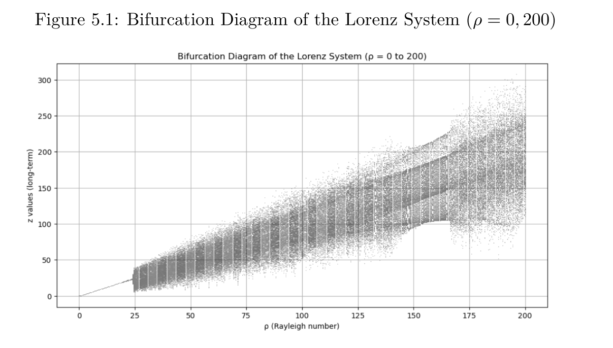
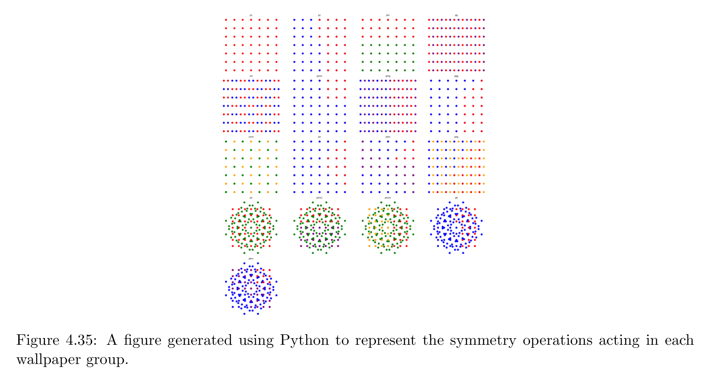
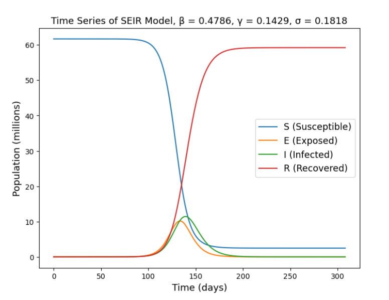

## Who am I?

</img>

* Dr Killian O'Brien 
* Senior Lecturer in mathematics
* Background in pure mathematics, with knowledge of applied topics such as cryptography, ...
* **Contact**
    - [k.m.obrien@mmu.ac.uk](mailto:k.m.obrien@mmu.ac.uk)
    <!-- - DB 3.28, Dalton Building, Chester St, Manchester -->

These slides are available at 

* [tinyurl.com/esher2025](https://tinyurl.com/esher2025)

## What exactly is mathematics?
<!-- What your subject is and why it's important -->
A **tough** question to answer! I commonly say things like ...

* The study of numbers and space.
* How to reason correctly about our numerical and geometric descriptions of the world.
* An underlying language, essential for all the sciences.

At **school/college** and in **university/higher education**

* At school and sixth form college you experience studying mathematics as learning about tools that help you solve various *mathematical problems*. 
* In university, this broadens out to consider a huge range of tools, and more importantly, **how they are derived/invented** and how we **choose the right tools** to solve unfamiliar problems. 

A spectrum of applications, from **very applied**, to **very pure**.

* [Mathematical modelling and flow analysis at Man Met](https://www.mmu.ac.uk/research/groups/mathematical-modelling), Applied Mathematics Research at Man Met
* [Bounded gaps between the primes](https://terrytao.wordpress.com/tag/prime-gaps/) Terence Tao, Stanford, USA
    - Long been *conjectured* that there are **infinitely** many twin prime pairs, i.e., pairs of integers $n, n+2$ where both are **prime**, for example, $11,13$ or $17,19$ or $101,103$ or ... . But no one has managed to prove this yet. 
    - [Zhang (2014)](https://annals.math.princeton.edu/2014/179-3/p07) proved that, two primes can be found in the range $[n, n+70,000,000]$ for infinitely many $n$. 
    - Terence Tao (and others) have since improved this situation to: two primes can be found in the range $[n, n+246]$, for infinitely many $n$. 

## A mathematics student in UK higher education. 
<!-- What a typical student experience of studying your subject involves at uni, in terms of lectures, tutorials, seminars, workshops, practical work, field trips, etc. -->
A typical student will be learning about mathematics through a combination of 

* Lectures,
* Tutorials/seminars,
* Computer labs,
    - learning to program in languages like Python, Matlab, Mathematica, C++, ... 
* At Man Met our students typically have 12 hours of such face-to-face sessions timetabled each week. 

The rest of your study time is spent

* studying and learning the lecture content,
* following the suggested reading of books and academic papers from your courses,
* working on completing tutorial exercises and programming problems.

Lots of this is best done together with other students from your course. 

## A mathematics student in UK higher education. 

Most mathematics courses in UK universities will allow students to go on a **placement year** before their final year of study.

* In 2022 I oversaw placement activity from our department of Computing and Mathematics.
* We had **31** students on placement, from

||||
|:-|:-|:-|
|BSc Computer Forensics & Security (**5**) | BSc Computer Science (**6**) | BSc Computing (**3**)|
| BSc Mathematics (**4**) | BSc Software Engineering (**11**) | MComp Computer Science (**2**) | | |

* in England and Wales

|||||
|:-|:-|:-|:-| 
| Greater London (**2**)| North East England (**1**)| North West England (**18**)| South East England (**5**)|
| South West England (**1**) | Wales (**1**) | West Midlands (**1**) | Yorkshire and the Humber (**2**)|

* with the employers

||||||
|:--|:--|:-|:--|:--|
| Apadmi | Atkins | Atom Group | Aucoda (**2**) | Audit Partnership |
| BAE Systems |Computer Design Systems | Home Office | IBM (**3**) | Intelliscope |
|Jumping Rivers | Manchester United | Matillion |National Crime Agency | NHS (**2**)|
|Pinewood Technologies | TATA Steel | Team Netsol (**2**) | The Insights People | TIP Trailer Services (**2**) | 
| TopCashback (**2**) | Tyrrell Products | VMware | Zestia | | 

## Assessment
<!-- How assessment of your subject typically works e.g., exams, projects, group presentations, dissertations.  -->
* Mathematics students will typically be assessed through a combination of **examinations** and **coursework**. 
* Most mathematics courses require final year students to produce an **undergraduate thesis/project**.
* I am currently assessing our students' projects. Here are some of their titles. 
    - *Understanding Chaos in Dynamical Systems and Chaotic Encryption Methods*
    - *How many different types of wallpaper are there?*
    - *Exploring COVID-19 Pandemic Modelling and its Broader Applications*

 
 
 

## After graduation
<!-- What graduates of your subject typically go on to do workwise, post-graduate study etc.  -->
Studying mathematics allows you to develop skills that employers want

* Problem solving, Data Analysis, logical thinking, computer programming, technical writing,...

Mathematics students will find careers in many areas

* Teaching, Banking and Finance, Computing, Software development, 

Some useful resources

* [GORS](https://www.gov.uk/government/organisations/civil-service-government-operational-research-service), the Government Operational Research Service
* [Gradcracker](https://www.gradcracker.com/search/maths-business/maths-graduate-jobs), for job ads featuring *mathematics*

Students can also continue to Masters level study and PhD level research

* [Jobs.ac.uk](https://www.jobs.ac.uk/search/mathematics-and-statistics/phd), UK PhD positions in maths and related areas

## Preparing for university
<!-- What year 12's can be doing now to strengthen their applications for your subject -->

Extra things I would do if I was hoping to study mathematics at university

* Learn some introductory programming in Python, e.g. from [Codeacademy](https://www.codecademy.com/)
* Maybe progress to working on the [Advent of Code problems](https://adventofcode.com/)
* Explore many types of puzzles and problem solving, e.g. chess, Rubiks cube, ...
* Some competitive university courses in mathematics and computer science may require you to take extra mathematics exams such as MAT, TMUA and STEP.

## Teaching and research interests

* **Teaching** experience in core pure mathematics areas of 
    - Calculus, 
    - Linear Algebra, 
    - Number Theory and Cryptography, 
    - Group Theory and abstract algebra.
* **Research**
    - PhD in development of algorithms in abstract algebra (Groebner bases in polynomial ring ideals) with applications to knot theory (topology and geometry). 

