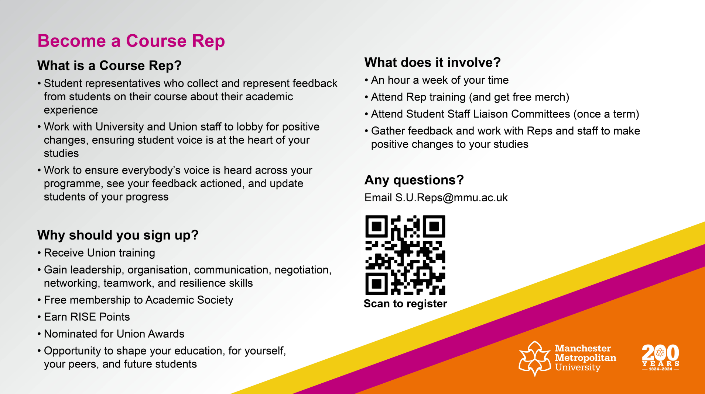

## Your wellbeing and support

* Lots of information on the [Wellbeing](https://www.mmu.ac.uk/student-life/wellbeing) pages

</img> 

## Contacting the Student Hub

* Ask us about things specific to your course. 
* The Student Hub in the Business School deals with general university enquiries.

The Student Hub can be busy in the first few weeks so do try and access their online provision in the first instance

* [Student Hub online](https://studenthub.mmu.ac.uk/)

## Personal Tutors

### Personal tutors

* You will have been allocated a personal tutor
* Your Personal tutor will be contacting you very soon, if not already. Keep an eye on your emails.
* Personal tutors provide support to guide you through your academic studies and support the development of your wider skills.

# Your attendance

* [mmu.ac.uk/attendance](https://attendance.mmu.ac.uk/)
* If your attendance and course engagement is too low you will be contacted by the university.
* If contacted make sure you **respond**.

</img> 

## Future Me week

* [Future Me](https://www.mmu.ac.uk/careers/students/future-me) information.

</img> 

## RISE at Man Met

* [RISE](https://rise.mmu.ac.uk/) information.

</img> 

## Your Student Union

* [The Union](https://www.theunionmmu.org/) website.

</img> 

## The Course Rep role

* [Course Reps](https://www.theunionmmu.org/student-voice/course-reps) information.

</img> 

## Bury Arcade Trip

To make your return really special, we’re organising a field trip to the [Bury Arcade Club](https://www.arcadeclub.co.uk/bury/) on Friday of Welcome Week (27th September 2024). This is a **free trip** and is open to all final year students in the Department of Computing and Mathematics.

If you would like to come along, please can we ask you to sign-up via the [this form](https://forms.office.com/Pages/ResponsePage.aspx?id=UPs_KAujjEiQ9M2uT3rm0Vm1UDwgYT1Np3HapUj9AF9UNzBFSTc2WFJMRUNROE1XOEpRVE4zRFNWUS4u)

On Friday the coach leaves the University at 12:00 noon. We’ll then drive to the Arcade Club, have approximately four hours to spend there, and then we’ll offer a return journey via coach. You are also welcome to make your own way there and meet us at the venue, but please still register at the form above.

If you have any questions about the trip, please reach out to the organiser, Anthony McCormick (a.mccormick@mmu.ac.uk).

#### Your HQ

{style="display:flex;margin-left: auto; margin-right: auto; width: 50%;"}

* Also, lots of study spaces available on ground, 1st and 2nd floors of the new Faculty Dalton Building on Chester Street. 

## Extensions on assesessments

* Illness and other exceptional events make interrupt your study and work on assessments. 
* The university's Evidenced Extensions process exists to deal with this.
* Typically awards extensions and decisions on penalty-free resits provided your exceptional factors are supported by **good evidence** and **accepted by** the Evidenced Extensions process.
* See [Assessment and Results](https://www.mmu.ac.uk/student-life/course/assessments) for more information.
* Short non-evidenced coursework extensions may be possible
    - see Moodle and unit teams for info during the Semester