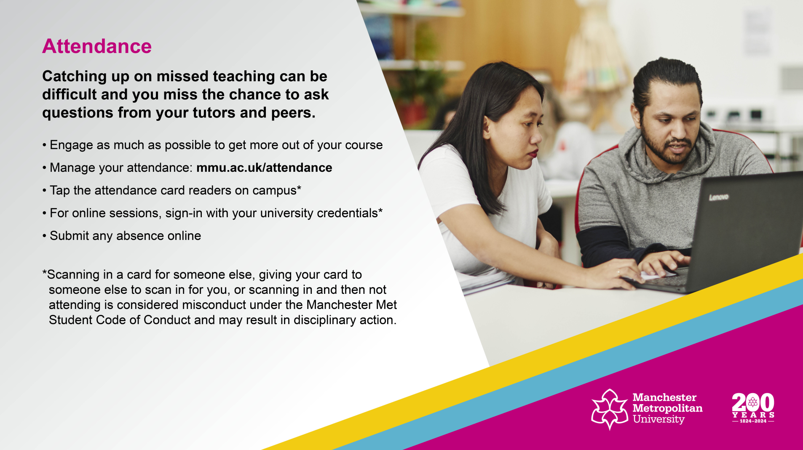
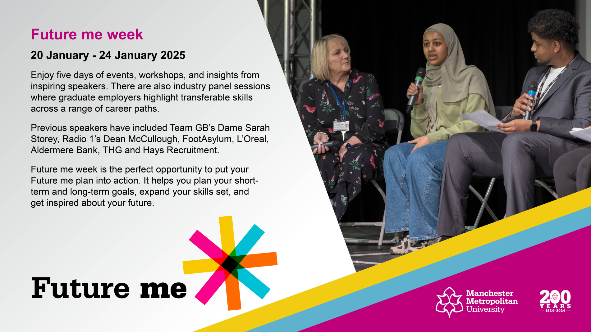
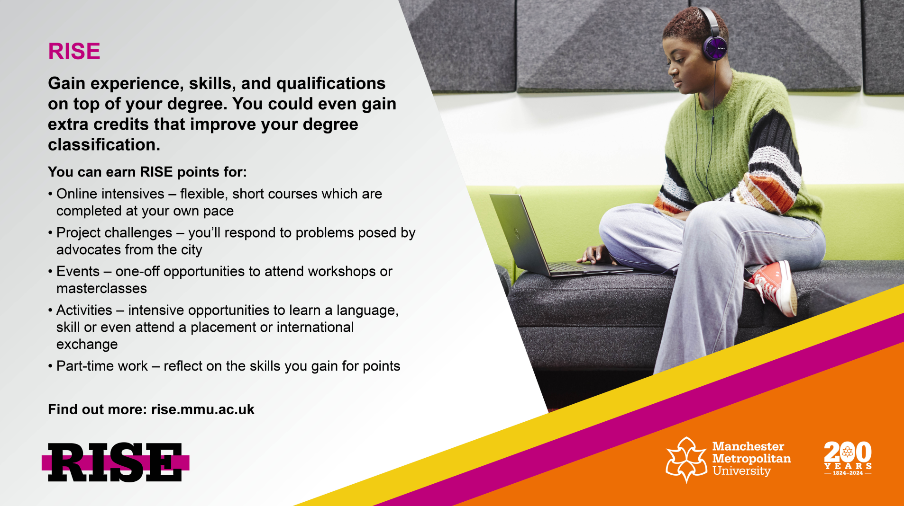
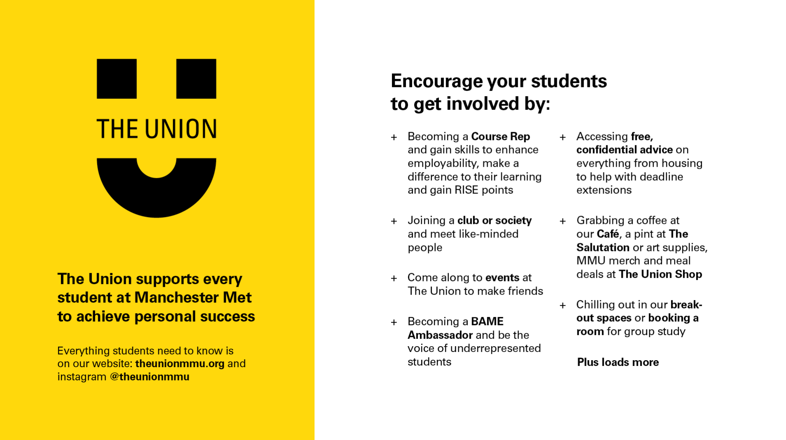
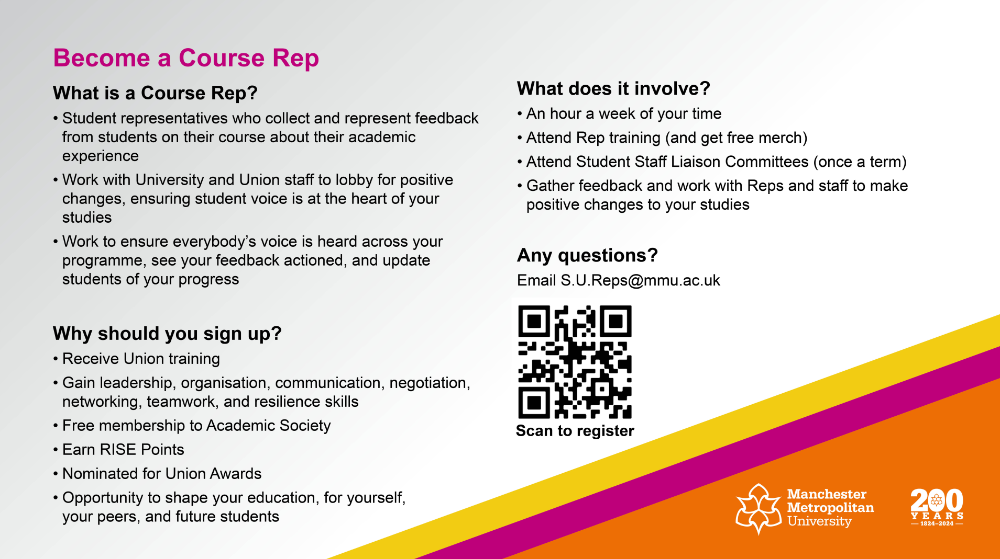
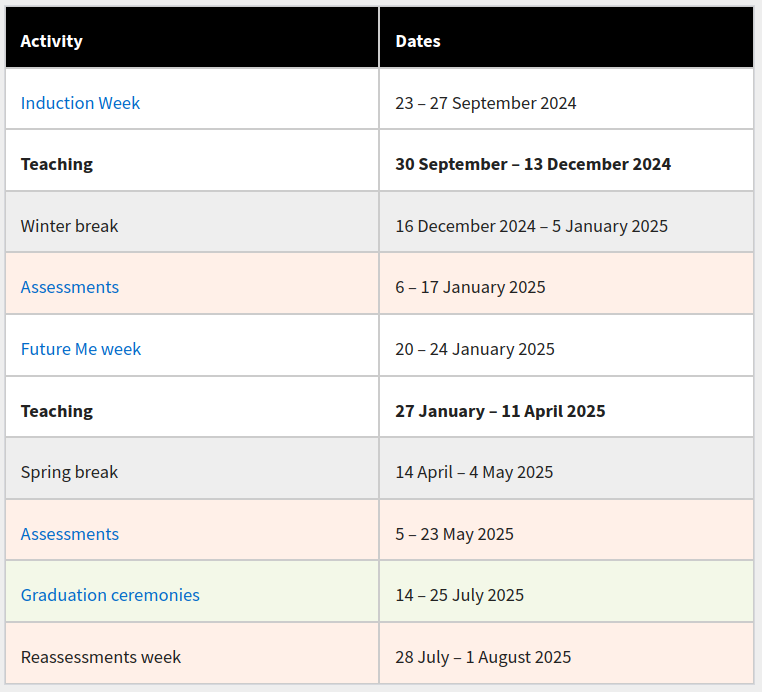

## Welcome back to level 5 of Mathematics

{style="display: block; margin-left: auto; margin-right: auto; width: 80%;"}

## Careers, employability and placements

It's never too early to be thinking about life after you graduate. The university has a range of resources to help students prepare for their future. See the main [Careers](https://www.mmu.ac.uk/careers/students) part of the university website for further information.

[MyCareerHub](https://mycareerhub.mmu.ac.uk/students/jobs) is the place to go for graduate, placement and internship vacancies and employment related events taking place in or near the university or online. 

### An important upcoming event

* [Graduate Jobs and Placement Fair Wed 6th November 2024](https://www.mmu.ac.uk/careers/students/events)

A placement is where a student works with an employer for the year between the second and third years of their degree.

* [Placements](https://www.mmu.ac.uk/careers/students/jobs-and-work-experience/placements) section of the Careers website. 
* [Get Placed 2024](https://www.mmu.ac.uk/careers/students/get-placed-2024) - focused events in semester one to help you succeed in your placement search and application. 

## Institute of Mathematics and its Applications

{style="display:flex;margin-left: auto; margin-right: auto; width: 50%;"}

* The IMA is one of the main professional bodies for mathematicians in the UK.
* A great resource of mathematics and career information.
* Events, publications, awards etc
* Reduced rate student membership for £10 or use the free IMA eStudent scheme.
* [IMA website](https://ima.org.uk) 

## Programme leader

* Our new **Programe Leader**: Dr Saeed Abu-Zour </img> 
	- [s.abu-zour@mmu.ac.uk](mailto:s.abu-zour@mmu.ac.uk)

* [Mathematics subject group staff pages](https://www.mmu.ac.uk/about-us/faculties/science-engineering/staff/computing-maths)

## Your wellbeing and support

* Lots of information on the [Wellbeing](https://www.mmu.ac.uk/student-life/wellbeing) pages

</img> 

## Contacting the Student Hub

* Ask us about things specific to your course. 
* The Student Hub in the Business School deals with general university enquiries.

The Student Hub can be busy in the first few weeks so do try and access their online provision in the first instance

* [Student Hub online](https://studenthub.mmu.ac.uk/)

## Personal Tutors

### Personal tutors

* You will have been allocated a personal tutor
* Your Personal tutor will be contacting you very soon, if not already. Keep an eye on your emails.
* Personal tutors provide support to guide you through your academic studies and support the development of your wider skills.

## Your attendance

* [mmu.ac.uk/attendance](https://attendance.mmu.ac.uk/)
* If your attendance and course engagement is too low you will be contacted by the university.
* If contacted make sure you **respond**.

</img> 

## Future Me week

* [Future Me](https://www.mmu.ac.uk/careers/students/future-me) information.

</img> 

## RISE at Man Met

* [RISE](https://rise.mmu.ac.uk/) information.

</img> 

## Your Student Union

* [The Union](https://www.theunionmmu.org/) website.

</img> 

## The Course Rep role

* [Course Reps](https://www.theunionmmu.org/student-voice/course-reps) information.

</img> 

## The academic year

* Note dates of assessment weeks. You **must** be present for these weeks. 
* Note that all 11 teaching weeks of Semester Two take place **before** the Easter/Spring break.

</img> 

## The units

#### Semester 1 

* 6G5Z3011 - MULTI-VARIABLE CALCULUS ANALYTICAL METHODS (15 credits) | Dr Killian O'Brien, Dr Saeed Abu-Zour
* 6G5Z3012 - FURTHER LINEAR ALGEBRA (15 credits) | Dr Saeed Abu-Zour
* 6G5Z3022 - NUMERICAL METHODS AND MODELLING (30 credits) | Dr Tariq Jarad, Dr Jian Zhou 

#### Semester 2 

* 6G5Z3018 - STATISTICS AND FINANCIAL MATHEMATICS (30 credits) | Dr Esmaeil Babaei Khezerloo
* 6G5Z3019 - NUMBER THEORY AND CRYPTOGRAPHY (30 credits) | Dr Killian O'Brien

#### Summative Assessments

* Each 30 credit unit assessed by coursework and exam - see unit introductions for details.
* Further linear algebra assessed by **exam only**.
* Multi-variable calculus and analytical methods assessed by **coursework only**.
* Exams are *3 hour traditional exam-hall style* held in the relevant semester assessment weeks.

## Degree Classifications

Degrees at Man Met are classified as first, 2.1, 2.2, etc using two methods. Both these methods are described in detail in the 

* [Undergraduate Assessment Regulations](https://www.mmu.ac.uk/legal/policies/undergraduate-assessment-regulations-24-25)

I won't duplicate, and thereby possibly confuse, the details here. You should use the regulations to acquaint yourself with the system so you know exactly where you stand.

* Conditions for *progression*, i.e. continuing to your next level of your course, are also specified in the 
regulations, and summarized on the [university's website here](https://www.mmu.ac.uk/student-life/course/assessments)

## Student Academic support and pastoral

Primary academic support for your studies comes from the unit teams and your personal tutor. Do make full use of 

* Lectures, tutorials and labs.
* The online resources provided through Moodle.
* Drop-in and bookable consultations (*office hours*) provided by staff. 
* Following the directed self-study parts of the unit, typically tutorial exercises etc. 

The university also provides a range of general academic support and study skills development opportunities.

* [Study skills](https://www.mmu.ac.uk/studyskills)

There is also help and support available for your wellbeing and mental health while at university.

* [Student Wellbeing](https://www.mmu.ac.uk/student-life/wellbeing/)

## Personal Learning Plans

*A Personal Learning Plan (PLP) is a document that outlines the support or 'reasonable adjustments' that the University will put in place for you to support your study due to your disability-related needs. It also includes a list of your responsibilities.*

* The reasonable adjustments often involve the ability to request extensions to the deadlines for coursework and/or extensions to the time allowed for examinations.
* But a range of other adjustments are possible to your learning and assessment arrangements depending on your situation.
* PLPs are shared with the acdemics teaching and assessing you.
* If you already have a PLP, familiarise yourself with its contents and ensure it is updated if need be.
* If you think you may need a PLP then see the information from the [Disability Support Service](https://www.mmu.ac.uk/student-life/wellbeing/disability/) and speak to them. 

## Academic engagement

Success will come from **good engagement with your course** and you **making the most of the opportunities** that studying at Man Met provides. 

We want you to succeed and will support you in doing so. 

We do monitor student engagement and take action when we feel it is necessary.

* If you are contacted by the university about your engagement
    - please respond promptly and act on their advice,
    - don't ignore the problem hoping it will *go away*.
* If your engagement remains poor and you do not respond to our contacts and advice then the university can begin withdrawal proceedings. 

But this is all *last resort* stuff. 

## On a more positive note

We all know the route to success and enjoyment of your course. It's not a mystery.

* Make sure you attend all your timetabled classes.
* Talk to and work with the other students on your course.
* Put energy into developing and maintaining friendships.
* Carry out the work required for your units. 
* Prepare for, and start work on, courseworks and exams at the earliest opportunity.
* Find good ways to relax and unwind.
* Make the most of being in **Manchester**.

## Extensions on assesessments

* Illness and other exceptional events make interrupt your study and work on assessments. 
* The university's Evidenced Extensions process exists to deal with this.
* Typically awards extensions and decisions on penalty-free resits provided your exceptional factors are supported by **good evidence** and **accepted by** the Evidenced Extensions process.
* See [Assessment and Results](https://www.mmu.ac.uk/student-life/course/assessments) for more information.
* Short non-evidenced coursework extensions may be possible
    - see Moodle and unit teams for info during the Semester

## Academic (mis)conduct

* The University has a thorough well-developed policy on Academic Misconduct which the Mathematics programme fully supports. 
* More information available from [Academic Misconduct](https://www.mmu.ac.uk/student-case-management/guidance-for-students/academic-misconduct/) site.
* You should maintain the highest standards of behaviour in all aspects of your academic work.

## Timetables

Let's check our timetables

* [mytimetable.mmu.ac.uk](https://mytimetable.mmu.ac.uk/)

## Mathematical software, lab computers and the Library

* A range of mathematical and scientific software is available from the PCs in the Dalton building and the specialist PCs in the library.
* Dalton building features new labs and student spaces. 
* See [Software download centre](https://www.mmu.ac.uk/about-us/professional-services/itd/software/) for a range of software available for students to install on their own machines - **Matlab** and **Python** in particular.
* I recommend having a local installation of [LaTeX](https://www.latex-project.org/) as well as using online tools like [Overleaf](https://www.overleaf.com/).
* [University Library](https://www.mmu.ac.uk/library) has a new home on Oxford Road, in what was the John Dalton East building. See website for details. 

## The Departmental Learning Studio

#### Your HQ

{style="display:flex;margin-left: auto; margin-right: auto; width: 50%;"}

## The Departmental Learning Studio

#### Your HQ

{style="display:flex;margin-left: auto; margin-right: auto; width: 50%;"}

* Also, lots of study spaces available on ground, 1st and 2nd floors of the new Faculty Dalton Building on Chester Street. 

## Bury Arcade Trip

To make your return really special, we’re organising a field trip to the [Bury Arcade Club](https://www.arcadeclub.co.uk/bury/) on Friday of Welcome Week (27th September 2024). This is a **free trip** and is open to all final year students in the Department of Computing and Mathematics.

If you would like to come along, please can we ask you to sign-up via the [this form](https://forms.office.com/Pages/ResponsePage.aspx?id=UPs_KAujjEiQ9M2uT3rm0Vm1UDwgYT1Np3HapUj9AF9UNzBFSTc2WFJMRUNROE1XOEpRVE4zRFNWUS4u)

On Friday the coach leaves the University at 12:00 noon. We’ll then drive to the Arcade Club, have approximately four hours to spend there, and then we’ll offer a return journey via coach. You are also welcome to make your own way there and meet us at the venue, but please still register at the form above.

If you have any questions about the trip, please reach out to the organiser, Anthony McCormick (a.mccormick@mmu.ac.uk).

## See you all next week

Killian O'Brien

* Email [k.m.obrien@mmu.ac.uk](mailto:k.m.obrien@mmu.ac.uk)
* Teams [https://teams.microsoft.com/l/chat/0/0?users=k.m.obrien@mmu.ac.uk](https://teams.microsoft.com/l/chat/0/0?users=k.m.obrien@mmu.ac.uk)
