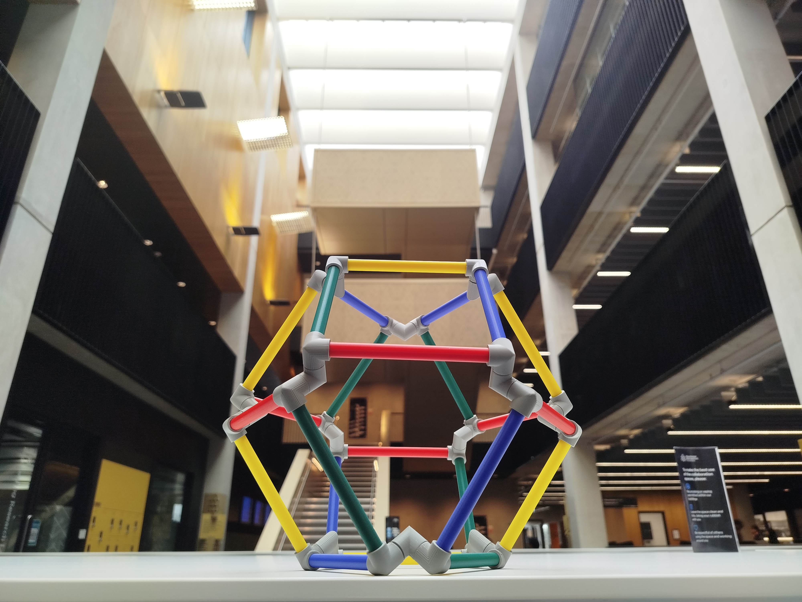
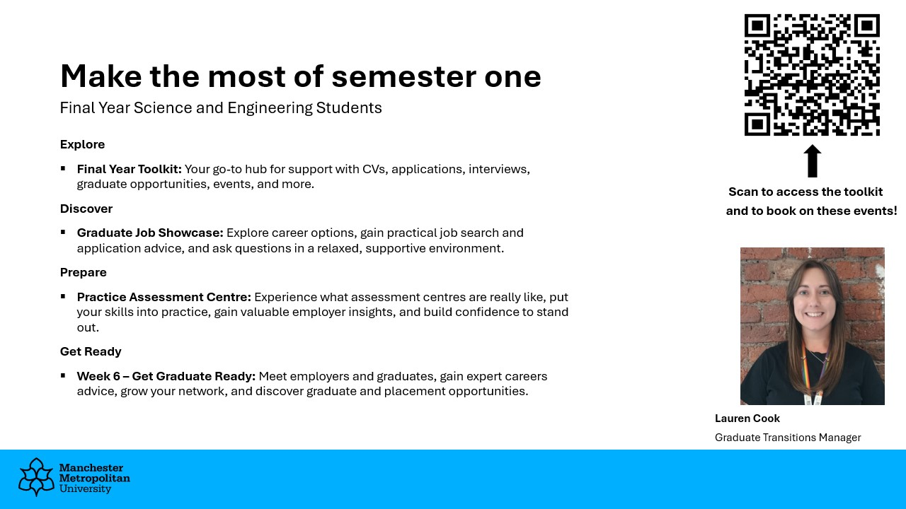

## Welcome back to the final year

{style="display: block; margin-left: auto; margin-right: auto; width: 70%;"}

## Careers & Employability

The university has a huge amount of support in place to help you secure the next step after completing your degree. There is a lot you could do in this first semester.

* An introduction from Lauren Cook, **Graduate Transitions Manager for the Faculty of Science and Engineering.**

<iframe id="kaltura_player" src='https://cdnapisec.kaltura.com/p/1128062/embedPlaykitJs/uiconf_id/51416912?iframeembed=true&amp;entry_id=1_041784ro&amp;config%5Bprovider%5D=%7B%22widgetId%22%3A%221_mnz1xxg2%22%7D&amp;config%5Bplayback%5D=%7B%22startTime%22%3A0%7D'  style="margin:auto;width: 400px;height: 285px;border: 0;" allowfullscreen webkitallowfullscreen mozAllowFullScreen allow="autoplay *; fullscreen *; encrypted-media *" sandbox="allow-downloads allow-forms allow-same-origin allow-scripts allow-top-navigation allow-pointer-lock allow-popups allow-modals allow-orientation-lock allow-popups-to-escape-sandbox allow-presentation allow-top-navigation-by-user-activation" title="Welcome to your final year"></iframe>

**Those key dates from the video**

* **Week 2**: [Graduate job showcase](https://mycareerhub.mmu.ac.uk/students/events/Detail/4710424){target=_blank}, **Thursday 14 October**, 1st floor Dalton mezzanine, an opportunity for students to see live graduate jobs linked to their course, along with good and bad examples of CVs.
* **Week 3**: [Practice assessment centre](https://mycareerhub.mmu.ac.uk/students/events/Detail/4714082){target="_blank"}, **Wednesday 21 October** with Jaguar Land Rover, Siemens, Bank of New York, Tata Consultancy services.
* **Week 6**: Get Graduate Ready: [www.mmu.ac.uk/week6](http://www.mmu.ac.uk/week6){target="_blank"}  (Science and Engineering information will go live on 12 October)

**Looking further ahead** 

* [Graduate Jobs and Placements Fair Wed 11th November 2026](https://www.mmu.ac.uk/news-and-events/events/detail/graduate-jobs-and-placements-fair-2026){target="_blank"}

* [MyCareerHub](https://mycareerhub.mmu.ac.uk/students/jobs){target="_blank"} is the place to go for graduate, placement and internship vacancies and employment related events taking place in or near the university or online.

## Careers & Employability

The university has a huge amount of support in place to help you secure the next step after completing your degree. There is a lot you could do in this first semester.

* An introduction from Lauren Cook, **Graduate Transitions Manager for the Faculty of Science and Engineering.**

<iframe id="kaltura_player" src='https://cdnapisec.kaltura.com/p/1128062/embedPlaykitJs/uiconf_id/51416912?iframeembed=true&amp;entry_id=1_041784ro&amp;config%5Bprovider%5D=%7B%22widgetId%22%3A%221_mnz1xxg2%22%7D&amp;config%5Bplayback%5D=%7B%22startTime%22%3A0%7D'  style="margin:auto;width: 400px;height: 285px;border: 0;" allowfullscreen webkitallowfullscreen mozAllowFullScreen allow="autoplay *; fullscreen *; encrypted-media *" sandbox="allow-downloads allow-forms allow-same-origin allow-scripts allow-top-navigation allow-pointer-lock allow-popups allow-modals allow-orientation-lock allow-popups-to-escape-sandbox allow-presentation allow-top-navigation-by-user-activation" title="Welcome to your final year"></iframe>

**More resources**

* Final year toolkit - [www.mmu.ac.uk/sefinalyeartoolkit](http://www.mmu.ac.uk/sefinalyeartoolkit){target="_blank"}  
    - All events/resources for final years will be updated on this toolkit throughout the year.
    - This is a central referral place for all final year students.
* Further study: masters, PhD, ...
    - [Further Study info](https://www.mmu.ac.uk/careers/graduates/further-study){target="_blank"} pages on the Careers website
    - Application processes, funding sources vary. The pages above are a good start.
    - Soem interesting initiatives and schemes out there, including the [Martingale Postgraduate Foundation scheme](https://martingale.foundation/){target="_blank"}
    
**In person support**

* [Careers space](https://www.mmu.ac.uk/careers/students/careers-space){target="_blank"} - Open 10am to 4:30pm, Monday to Friday. Get one-to-one advice from our friendly team of student Careers Associates about any aspect of career planning, job searching and applying for work.
* [Ask a Question](https://mycareerhub.mmu.ac.uk/students/questions/){target="_blank"} – Submit a careers-related question and receive online guidance or feedback from the Careers Service.

## Lauren's Summary

{style="display: block; margin-left: auto; margin-right: auto; width: 90%;"}

## Institute of Mathematics and its Applications

{style="display:flex;margin-left: auto; margin-right: auto; width: 50%;"}

* The IMA is one of the main professional bodies for mathematicians in the UK.
* A great resource of mathematics and career information.
* Events, publications, awards etc
* Reduced rate student membership for £10.
* [IMA website](https://ima.org.uk){target="_blank"}, and their [Student membership](https://ima.org.uk/membership/membership-grades/student/){target="_blank"} page

## Programme leader & Staff pages

* Our **Programe Leader**: Dr Killian O'Brien </img> 
* [k.m.obrien@mmu.ac.uk](mailto:k.m.obrien@mmu.ac.uk)
* [Mathematics subject group staff pages](https://www.mmu.ac.uk/about-us/faculties/science-engineering/staff/computing-maths){target="_blank"}

## The academic year 

<table class="table" style="background-color: rgb(255, 255, 255); min-width: 300px;"><colgroup><col><col></colgroup><tbody><tr id="section-1533376089" class="block-container"><th id="section-437361784" class="block-container cell-align-undefined" style="background-color: rgb(0, 0, 0); color: rgb(255, 255, 255);">

Activity

</th><th id="section-822954620" class="block-container cell-align-undefined" style="background-color: rgb(0, 0, 0); color: rgb(255, 255, 255);">

Dates

</th></tr><tr id="section-2115351863" class="block-container"><td id="section-1615303447" class="block-container cell-align-undefined">

Induction Week

</td><td id="section-80615633" class="block-container cell-align-undefined">

28 September – 2 October 2026

</td></tr><tr id="section-620233428" class="block-container"><td id="section-342358954" class="block-container cell-align-undefined">

<strong>Teaching (11 wks)</strong>

</td><td id="section-755597476" class="block-container cell-align-undefined">

<strong>5 October – 18 December 2026</strong>

</td></tr><tr id="section-135679158" class="block-container"><td id="section-1455894830" class="block-container cell-align-undefined" style="background-color: rgb(238, 238, 238);">

Winter break (3 wks)

</td><td id="section-432498802" class="block-container cell-align-undefined" style="background-color: rgb(238, 238, 238);">

21 December 2026 – 10 January 2027

</td></tr><tr id="section-896748066" class="block-container"><td id="section-1348864914" class="block-container cell-align-undefined" style="background-color: rgba(255, 106, 0, 0.1);">

<a target="_self" rel="noopener noreferrer nofollow" href="/page/12092">Assessments</a>

</td><td id="section-260181813" class="block-container cell-align-undefined" style="background-color: rgba(255, 106, 0, 0.1);">

11 –
22 January 2027

</td></tr><tr id="section-1743388681" class="block-container"><td id="section-1885161776" class="block-container cell-align-undefined">

<a href="https://mmuintranet.mmu.ac.uk/Interact/Pages/Content/Document.aspx?id=8937" target="_self">Future Me week</a>

</td><td id="section-272932431" class="block-container cell-align-undefined">

25 – 29 January 2027

</td></tr><tr id="section-1402143814" class="block-container"><td id="section-743069850" class="block-container cell-align-undefined">

<strong>Teaching (7 wks)</strong>

</td><td id="section-782169945" class="block-container cell-align-undefined">

<strong>1 February – 19 March 2027</strong>

</td></tr><tr id="section-1004553427" class="block-container"><td id="section-1580886369" class="block-container cell-align-undefined" style="background-color: rgb(238, 238, 238);">

Spring break (3 wks)

</td><td id="section-1272151519" class="block-container cell-align-undefined" style="background-color: rgb(238, 238, 238);">

22 March – 11 April 2027

</td></tr><tr id="section-515284748" class="block-container"><td id="section-1491401833" class="block-container cell-align-undefined">

<strong>Teaching (4 wks)</strong>

</td><td id="section-1738677482" class="block-container cell-align-undefined">

<strong>12 April – 7 May 2027</strong>

</td></tr><tr id="section-1322783208" class="block-container"><td id="section-1935791088" class="block-container cell-align-undefined" style="background-color: rgba(255, 106, 0, 0.1);">

<a target="_self" rel="noopener noreferrer nofollow" href="/page/12092">Assessments</a>

</td><td id="section-946158537" class="block-container cell-align-undefined" style="background-color: rgba(255, 106, 0, 0.1);">

10 – 21 May 2027

</td></tr><tr id="section-1610195436" class="block-container"><td id="section-713534869" class="block-container cell-align-undefined" style="background-color: rgba(255, 106, 0, 0.1);">

Reassessments week

</td><td id="section-1702634663" class="block-container cell-align-undefined" style="background-color: rgba(255, 106, 0, 0.1);">

2 – 6 August 2027

</td></tr></tbody></table>

## The modules

#### Semester 1 

* Computational Methods in Ordinary Differential Equations • 6G6Z3017 • 30 credits | Dr Jon Shiach & Dr Zhihua Ma
* Applied Regression and Multivariate Analysis • 6G6Z3020 • 30 credits | Dr Philip Sinclair & Dr Ehsan Kharati

#### Semester 2 

* Mathematics Project • 6G6Z3015 • 30 credits | Prof Ling Qian and your project supervisor
    - Project selection process will open on 2nd November and run for three weeks.

And **one of** the two option modules

* Numerical Methods for Partial Differential Equations • 6G6Z3019 • 30 credits | Dr Wei Bair and Prof Ling Qian
* Advanced Operational Research • 6G6Z3011 • 30 credits | Dr Philip Sinclair

**Timetables**
Let's check our timetables at [mytimetable.mmu.ac.uk](https://mytimetable.mmu.ac.uk/){target="_blank"}

**Summative Assessments**
All the detail will be given in your module sessions.

* Each 30 credit taught module assessed by coursework and exam.
* The Project module is assessed by the submission of your project report, a short presentation and an academic poster session.

## Degree Classifications

Your degree at Man Met is classified as first, 2.1, 2.2, etc using whichever of these two methods gives the higher classification

* **Main Method:** a *weighted average of your second and final year marks*
* **Profiling Classification:** a method that looks at your *final year modules only*.

I won't duplicate, and thereby possibly confuse, the details here. You should use the assessment regulations below to acquaint yourself with the system so you know exactly where you stand.

* [Undergraduate Assessment Regulations](https://www.mmu.ac.uk/legal/policies/undergraduate-assessment-regulations-24-25){target="_blank"}

## Student Academic support and pastoral care

**Personal Tutors:**

* Personal tutors will be assigned soon. Look out for their initial communication and attend the personal tutor meetings.

**Academic engagement:**
Primary academic support for your studies comes from the unit teams and your personal tutor. Do make full use of 

* Lectures, tutorials and labs.
* The online resources provided through Moodle.
* Drop-in and bookable consultations (*office hours*) provided by staff. 
* Following the directed self-study parts of the unit, typically tutorial exercises etc. 

The university also provides a range of general academic support and study skills development opportunities.

* [Study skills](https://www.mmu.ac.uk/studyskills){target="_blank"}

There is also help and support available for your wellbeing and mental health while at university.

* [Student Wellbeing](https://www.mmu.ac.uk/student-life/wellbeing/){target="_blank"}

**Class representatives**

* Volunteer as a [Class Rep](https://www.theunionmmu.org/student-voice/course-reps), help represent your class in meetings with academics, gain training and recognition from the Students Union.

## Personal Learning Plans

*A Personal Learning Plan (PLP) is a document that outlines the support or 'reasonable adjustments' that the University will put in place for you to support your study due to your disability-related needs. It also includes a list of your responsibilities.*

* The reasonable adjustments often involve the ability to request extensions to the deadlines for coursework and/or extensions to the time allowed for examinations.
* But a range of other adjustments are possible to your learning and assessment arrangements depending on your situation.
* PLPs are shared with the academics teaching and assessing you.
* If you already have a PLP, familiarise yourself with its contents and ensure it is updated if need be.
* If you think you may need a PLP then see the information from the [Disability Support Service](https://www.mmu.ac.uk/student-life/wellbeing/disability/){target="_blank"} and speak to them. 

## Mathematical software, lab computers and the Library

* A range of mathematical and scientific software is available from the PCs in the Dalton building and the specialist PCs in the library.
* Dalton building features new labs and student spaces. 
* See [Software download centre](https://www.mmu.ac.uk/about-us/professional-services/itd/software/){target="_blank"} for a range of software available for students to install on their own machines - **Matlab** and **Python** in particular.
* I recommend having a local installation of [LaTeX](https://www.latex-project.org/){target="_blank"} which can often bebetter than using subscription based online tools like [Overleaf](https://www.overleaf.com/){target="_blank"}.
* [University Library](https://www.mmu.ac.uk/library){target="_blank"} 

## Academic engagement

Success will come from **good engagement with your course** and you **making the most of the opportunities** that studying at Man Met provides. 

We want you to succeed and will support you in doing so. 

We do monitor student engagement and take action when we feel it is necessary.

* If you are contacted by the university about your engagement
    - please respond promptly and act on their advice,
    - don't ignore the problem hoping it will *go away*.
* If your engagement remains poor and you do not respond to our contacts and advice then the university can begin withdrawal proceedings. 

But this is all *last resort* stuff. 

## Academic (mis)conduct

* The University has a thorough well-developed policy on Academic Misconduct which the Mathematics programme fully supports. 
* More information available from [Academic Misconduct](https://www.mmu.ac.uk/student-life/course/assessments/academic-integrity){target="_blank"} site.
* You should maintain the highest standards of behaviour in all aspects of your academic work.
* Read coursework assessment documents carefully and make sure you are sticking to all the instructions and guidance given. 
* Pay particular attention to the guidance on the use of *generative AI / Large Language Models / chatbots / ...*
* The work you submit **must be your own** and you must be able to defend it if called upon to do so. 

## On a more positive note

We all know the route to success and enjoyment of your course. It's not a mystery.

* Make sure you attend all your timetabled classes.
* Talk to and work with the other students on your course.
* Put energy into developing and maintaining friendships.
* Carry out the work required for your units. 
* Prepare for, and start work on, courseworks and exams at the earliest opportunity.
* Find good ways to relax and unwind.
* Make the most of being in **Manchester**.

**Killian O'Brien**

* Email [k.m.obrien@mmu.ac.uk](mailto:k.m.obrien@mmu.ac.uk)
* Teams [https://teams.microsoft.com/l/chat/0/0?users=k.m.obrien@mmu.ac.uk](https://teams.microsoft.com/l/chat/0/0?users=k.m.obrien@mmu.ac.uk)
* Room 3.28 in the Dalton Building
