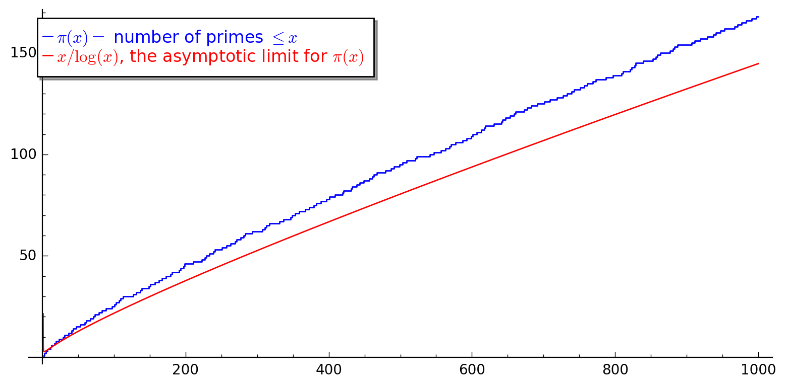
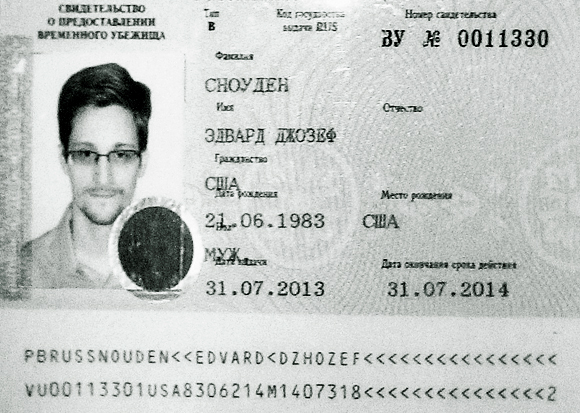

## The unit

* Optional unit running in second semester
* 4 hours lecture + 2 hour tutorial per week
* Assessment: Coursework problems (40%), Examination (60%)
* Popular unit (36 students in 2021/22)

## Number Theory

* The study of the integers $$\mathbb{Z} = \{ \dots -3, -2, -1, 0, 1, 2, 3, \dots \}$$
* Of fundamental importance are the primes $$2, 3, 5, 7, \dots $$
* The unit features a nice mixture of proof oriented theoretical work and practical algorithmic methods

## Cryptography

* The science/art of transforming *plaintext* into *ciphertext* so that it can only be by those possessing a secret key, that can reverse the encryption process. 
* Often in connection to military/industrial/political/... secrets.
* Universally and intensively used in modern computer network communications.

## Software

* Interesting use of mathematical software for various aspects of the unit
    - Matlab
    - [SageMath](https://www.sagemath.org), an open source software system aimed at pure mathematics
    - [CoCalc](https://cocalc.com), SageMath, and other maths software, in the cloud
    - [Python](https://www.python.org/), a general purpose programming language with many advanced math libraries

## A quick tour of some highlights from the unit

## Integers in the news

What's so special about ... ?

> - $82,589,933$
> - $2^{82,589,933} - 1$

. . .

The $51$st known Mersenne prime found by the [GIMPS](http://www.mersenne.org/) project, in December 2018.

## Open conjecture or tutorial problem?

> * There are infinitely many prime numbers.
> * $2^n - 1$ can only be prime when $n$ is prime.
> * There are infinitely many $2^n -1$ which are prime.

## Some Python SageMath code

The following SageMath code finds the first few Mersenne primes. See the [results](https://sagecell.sagemath.org/?z=eJxLyy9SKFDIzFMoKMrMTY0vSsxLT9Uw1DE0iDPStOLlUgCCzDSFzOJ4sLyGUVyBgq6CIUwKBIASeSUaBZroImClhpoAPPsZcA==&lang=sage)

~~~~
for p in prime_range(1,10^2):
    if is_prime(2^p - 1):
        print(p)
        print(2^p -1)
~~~~

## Counting the primes

## Open conjecture or tutorial problem?

* There are infinitely many primes $p$ for which $p+2$ is also prime, i.e. *narrow* steps on the $\pi$ staircase.
* For any integer $n \geq 1$ there are infinitely many gaps of at least length $n$ between consecutive primes, i.e. *wide* steps on the $\pi$ staircase.

## Classical vs. modern cryptography

## Classical

* Topics include mono- and poly-alphabetic substitution ciphers.
* Classical cryptography required prearranged secrets between sender and recipient.
* Can be broken with the aid of frequency analysis and other vulnerabilities.

## Modern

* Crypto systems based on number theoretic concepts.
* Prearranged secrets no longer required, so called *Public Key Cryptography*.
* Enables secure mass communication between anyone across public non-secure networks.
* Increasingly important application in crypto-currency such as Bitcoin

## Who is this?

</section>

## Who was that?

* Edward Snowden, former worker for the CIA and NSA.
* In 2013, he fled the USA, briefly staying in Hong Kong before securing temporary asylum in Russia.
* Has passed many thousands of classified files from the NSA, GCHQ and other intelligence agencies to journalists.
* These revelations concern global surveillance programs carried out by these agencies on the public.

## Public key cryptography 

### How did Snowden make secure contact with journalists he had never met?

## Public key cryptography

<iframe width="80%" height = "80%" style="display:block;margin:auto;" src="https://www.youtube.com/embed/GiU2zinfotI" title="YouTube video player" frameborder="0" allow="accelerometer; autoplay; clipboard-write; encrypted-media; gyroscope; picture-in-picture" allowfullscreen></iframe>

