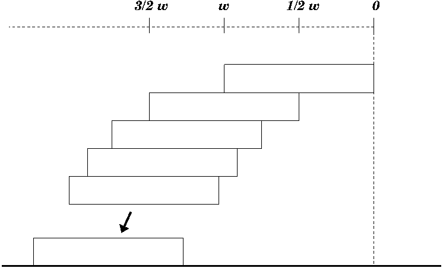

## The challenge

* Make a tower of bricks ...  
* with as much of an overhang as you can.

## An optimal solution for simple stacking
### A couple of basic principles

* A body balances on a flat surface if its centre of gravity lies over the `footprint'.
* Determine the (horizontal) location of a stack's centre of gravity by `averaging' over the locations of centres of the blocks.

### Iterate the following construction

* Build by adding to the bottom of the pile
* When adding a block, position its edge directly under the centre of gravity of the existing stack.

## Analyzing the solution
### Defining $h_n$
Let $h_n$ denote the overhang of this optimal simple stack of $n$ blocks, each of width $w$.

$$h_n = \text{ centre of gravity of the upper $n-1$ blocks} $$

## A recurrence formula for $h_n$

$$\begin{align*}
h_1 & = 0 , \\
h_n &= h_{n-1} + \frac{1}{n-1} \frac{w}{2}
\end{align*}$$

